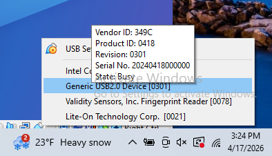

# Lab: Kali VM Setup

**Type:** Lab
**Duration:** 30–45 minutes
**Section:** Day 1 – Getting Started

---

## The Big Picture (Read This First)

Before we touch a drone, everyone needs the **same toolkit** on their laptop. This lab gets your **Kali Linux virtual machine** ready for every exercise in the next two days.

The good news: you do **not** install 15 tools by hand. The workshop ships one script — `install-workshop-apps.sh` in `~/workshop/apps` — that installs and configures everything at once. Your job in this lab is to **run that script, then verify each tool works**, so you never lose lab time to a missing program.

**What you'll do:** start the VM → copy the workshop files onto it → run the installer → verify the toolkit → learn the one VirtualBox trick (USB passthrough) that every hardware lab depends on.

> **Do this before class, or in the first session.** A full install downloads a few hundred MB and takes **15–30 minutes** on conference WiFi. Start it early and read ahead while it runs.

---

## What Gets Installed (and Which Lab Needs It)

The installer is just a menu of small install functions. Here is what each one gives you and where you'll use it:

| Tool | What it's for | Used in |
|------|---------------|---------|
| **Wireshark** (+ MAVLink & OpenDroneID plugins) | Capture and decode network/radio traffic | Labs 14, 18 |
| **ADB** (Android Debug Bridge) | Talk to the Android phone / pull APKs | Lab 08 |
| **JADX** | Decompile Android APKs to readable Java | Lab 08 |
| **Frida** (+ fridump3) | Hook a running app, dump its memory | Lab 08 |
| **QGroundControl** | The official drone GCS app | Lab 06 |
| **MAVProxy** | Command-line GCS / MAVLink Swiss-army knife | Labs 06, 10, 16, 18 |
| **Mission Planner** | Windows-style GCS + log analysis (via Mono) | Labs 06, 22 |
| **SDRangel** | Software-defined-radio receiver + decoders | Lab 20 |
| **nrfutil** | Flash & drive the nRF52840 BLE sniffer | Lab 14 |
| **sikw00f** | SiK telemetry radio recon tool | Lab 16 |
| **hcxdumptool / hcxtools** | Wi-Fi handshake capture & conversion | Lab 12 |
| **Foundation:** git, python3/venv, OpenJDK 21, curl, unzip | Prereqs everything else builds on | All labs |

---

## Prerequisites

- A laptop with **VirtualBox** installed (plus the **Extension Pack** — needed for USB 2.0/3.0 passthrough)
- The **Kali Linux VM** one that was downloaded or one can be provided for the class (a `.ova` appliance or a ready-made VM)
- The **workshop directory** (contains the `workshop/` folder: `apps/`, `files/`, `day1/`, `day2/`, `img/`)
- A working **internet connection** (the installer downloads packages)
- Default Kali login: **`kali` / `kali`** for new Kali VM

---

## Phase 1: Start Your Kali VM

1. Open **VirtualBox**.
2. If the VM isn't imported yet: **File → Import Appliance →** select the provided `Kali.ova` → **Import**.
3. Select the Kali VM and click **Start**.
4. Log in with **`kali` / `kali`**.
5. Open a terminal and confirm you have internet:

```bash
ping -c 3 8.8.8.8
```

If ping fails, check **VirtualBox → Settings → Network → Adapter 1 → Attached to: NAT**, then retry.

---

## Phase 2: Copy the Workshop Files onto the VM

The installer expects the workshop folder at **`~/workshop`** (i.e. `/home/kali/workshop`).


```bash
# Make sure you are in your home directory
cd ~

# Clone the whole workshop folder into your home directory
git clone https://github.com/dwdrone/workshop.git

# Confirm the apps folder is there
ls ~/workshop/apps
# You should see: install-workshop-apps.sh  libfuse2.sh  runQGC.sh  README.md
```

---

## Phase 3: Run the Installer

The script must be run **from inside the `apps` directory** (it uses relative paths to copy plugin files from `../files`).

```bash
cd ~/workshop/apps

# Make it executable (first time only)
chmod +x install-workshop-apps.sh

# Run it
./install-workshop-apps.sh
```

**What to expect:**
- It will ask for your **sudo password** (`kali`) early on — enter it and let it run. If you changed your password use that.
- It updates the system, then installs each tool in turn (you'll see `--- Installing ... ---` banners).
- Python tools (Frida, MAVProxy, sikw00f) are each installed into their **own virtual environment** under `~/workshop/apps/<tool>/` and added to your `PATH`.
- Total time: **15–30 minutes.** It's normal for it to sit quietly during large downloads.

> **Leave it alone until you see `Installation complete!`** If it stops with a red error, note the last `--- Installing X ---` banner — that tells you which tool failed, and the Troubleshooting section below covers the common ones.

---

## Phase 4: Finish Setup (Three Small Steps)

A couple of changes only take effect after you refresh your shell and session:

# reload
**1. Reload your shell so the new tool paths are active**
```bash
source ~/.bashrc
```

# edit
**2. Make your sudo passwordless**
```bash
vi /etc/sudoers
# enter edit mode
i
# change this: 
%sudo ALL=(ALL) ALL
# to this: 
%sudo ALL=(ALL) NOPASSWD:ALL
# exit edit mode
:esc:
# force the save with the following key presses
:w!
:q!
```

# change 
**3. Log out and back in** (or reboot the VM). This is required so that:
- Your user joins the **`wireshark`** group (needed to capture packets without root), and
- The Python tool `PATH` entries load in every new terminal.

```bash
# Quick way to reboot the VM
sudo reboot
```

---

## Phase 5: Verify Your Toolkit

Run these after rebooting. Each should print a version or open a window — **not** `command not found`.

```bash
# --- Core ---
python3 --version
java -version
git --version
adb version

# --- Analysis / GCS ---
wireshark --version | head -1
jadx --version

# --- Radio ---
snap list sdrangel        # SDRangel installed via snap
```

The nrfutil will attempt to download firmware on first invocation. If not connected to the internet, you will see failures, but this expected. Verify you do not see `command not found`

```bash
nrfutil --version
```

To check mavproxy, first source the environment

```bash
cd ~/workshop/apps/mavproxy
source mavproxy_venv/bin/activate
mavproxy.py
deactivate
cd
```

**GUI tools** — launch each once to confirm it opens, then close it:

```bash
jadx-gui &                                   # Android decompiler (Lab 08)
cd ~/workshop/apps/QGroundControl && ./runQGC.sh &   # QGroundControl (Lab 06)
# you can use the [x] button on upper right hand corner to close QGC
```

**Python venv tools** (Frida, sikw00f) live in their own environments. If a command isn't found on the `PATH`, activate its venv directly:

```bash
# Frida (Lab 08)
frida --version  || source ~/workshop/apps/frida/frida_venv/bin/activate && frida --version
```

```bash
# sikw00f (Lab 16)
cd ~/workshop/apps/sikw00f
source sikw00f_venv/bin/activate
cd sikw00f
python3 sikwoof.py
deactivate
cd
```

### Setup Checklist

Check each item before class starts:

| # | Item | OK? |
|---|------|-----|
| 1 | VM boots and has internet | ☐ |
| 2 | `~/workshop/apps` exists | ☐ |
| 3 | Installer finished with `Installation complete!` | ☐ |
| 4 | Rebooted; user is in the `wireshark` group (`groups \| grep wireshark`) | ☐ |
| 5 | `adb`, `mavproxy.py`, `nrfutil`, `wireshark`, `jadx` all report a version | ☐ |
| 6 | QGroundControl opens | ☐ |
| 7 | You can pass a USB device through to the VM (Phase 6) | ☐ |

---

## Phase 6: VirtualBox USB Passthrough (You'll Use This All Week)

Almost every hardware lab works by handing a **physical USB device** from your laptop to the Kali VM. Learn this once here.

**How to pass a device through:**
1. Plug the device into your laptop.
2. In the running VM's window menu, go to **Devices → USB**.
3. Click the device name — a checkmark means it's now attached to Kali.



**The devices you'll pass through, and the lab each belongs to:**

| Device | Appears as | Lab |
|--------|-----------|-----|
| Gigastone USB / microSD reader | `Mass Storage` | Lab 04 (firmware) |
| TP-Link Wi-Fi adapter | `Realtek 802.11ac WLAN Adapter` | Lab 12 (Wi-Fi) |
| HackRF One SDR | `Great Scott Gadgets HackRF One` | Labs 11, 16, 20 |
| nRF52840 dongle | `Nordic … / ZEPHYR nRF Sniffer` | Lab 14 (Remote ID) |
| Android phone | Nexus 6P | Lab 08 (Android) |


> **If the Devices → USB menu is greyed out or empty:** install the **VirtualBox Extension Pack** on the host, and make sure the VM's **Settings → USB** is set to a **USB 2.0 (EHCI)** or **USB 3.0 (xHCI)** controller. Then re-plug the device.

---

## Troubleshooting

**QGroundControl won't launch / crashes immediately**
QGC is an AppImage that needs the older `libfuse2`. The installer builds it via `libfuse2.sh`. Always start QGC with the helper script, which fixes `/etc/mtab` first:
```bash
cd ~/workshop/apps/QGroundControl && ./runQGC.sh
```

**Mission Planner: SSL / certificate errors on first run**
Changes in the mono library have affected the mono-debug library files. You may need to prepend the `TERM=dumb` definition to `mono` commands. Mission Planner runs on **Mono** and needs the Mono CA certificates the installer added. If you still see cert errors, re-run:
```bash
sudo TERM=dumb certmgr -ssl https://autotest.ardupilot.org/LogMessages/Copter/LogMessages.xml.xz
```

**`command not found` for frida / mavproxy.py / sikw00f**
These live in per-tool virtual environments. Refresh your shell, or activate the venv directly:
```bash
source ~/.bashrc
# or, for a specific tool:
source ~/workshop/apps/mavproxy/mavproxy_venv/bin/activate
```

**Wireshark says you can't capture / no interfaces**
You must be in the `wireshark` group *and* have logged out/in since install:
```bash
groups | grep wireshark      # should list 'wireshark'
sudo usermod -aG wireshark kali   # if missing, then reboot
```

**`snap` command not found / SDRangel missing**
`snapd` needs a re-login to add `/snap/bin` to your PATH:
```bash
source /etc/profile.d/apps-bin-path.sh 2>/dev/null; snap list
```

**ADB shows no device (Lab 08)**
Confirm the phone is passed through (Phase 6), set the phone's USB mode to **Transfer files**, enable **USB debugging**, and accept the *Allow USB debugging?* prompt on the phone:
```bash
adb kill-server && adb start-server
adb devices        # should list one device as 'device', not 'unauthorized'
```

---

## Optional: Read the Course in Your Browser

The slide dashboard and all lab guides can be served locally from your `~/workshop`
folder, so you can read the labs in a browser instead of on the projector:

```bash
cd ~/workshop
./serve.sh
# then open the printed link, e.g. http://localhost:8000/slides/index.html
# (Ctrl+C to stop)
```

---

## You're Ready

When your checklist is all ticked, your VM matches every instructor demo for the next two days. If anything is still red, flag an instructor now — it's much cheaper to fix here than mid-lab.

Next up: **Module 01 — UAS Cybersecurity**, where we put names to the attack chain you'll run on a real drone.

