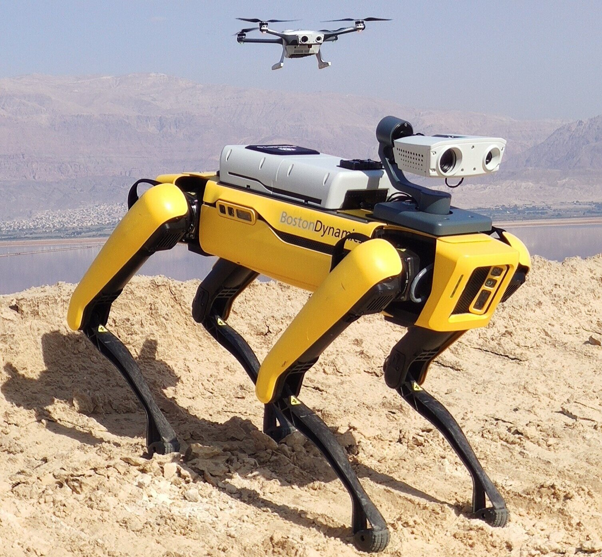
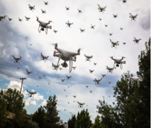

# Intro - UAS Cybersecurity

**Type:** Presentation
**Duration:** 60 minutes
**Section:** Day 1 – UAV & Drone

---
## Instructors 

**Ron Broberg**

- Penetration Tester @ Dark Wolf

- Previously @ Lockheed Martin

- Specializing in UAS, IoT and RF 

- DC31 Black Badge Winner IoT CTF

## Instructors

**Rudy Mendoza**

- Penetration Tester @ Dark Wolf

- Previoulsy with the U.S Air Force

- Specializing in UAS, and IoT

- DC31 Black Badge Winner IoT CTF

## Objectives

- Intro to UAS
- Identify the UAS threat landscape
- Understand attack vectors targeting UAS
- Apply core security principles to UAS contexts
- Survey the regulatory and framework landscape

---

## What is a UAS?

- Definition of UAS
- Components: UAV, ground control, communication links
- Civilian and military applications
- Rapid growth in usage
- Increasing complexity
 

---
## UAS Cybersecurity Overview

- Unique cyber risks for UAS
- Integration of IT and OT systems
- High-value targets
- Potential for remote attacks
- Need for robust security

## Threat Landscape

### Eavesdropping
- Intercepting unencrypted telemetry, video feeds, or RC commands
- Passive capture with SDR hardware (RTL-SDR, HackRF One)
- Reveals flight paths, operator locations, payload data

### GPS Spoofing
- Feeding false GPS signals to the drone's GNSS receiver
- Causes the drone to fly to unintended locations or return to a false home
- Cheap SDR hardware can generate spoofed signals

### Command Hijacking (C2 Takeover)
- Injecting unauthorized MAVLink or RC commands
- Requires access to the control channel
- Can force landing, RTL, or custom waypoints

### Data Theft
- Exfiltrating flight logs, mission plans, camera footage
- Often accomplished via GCS network access or physical access to SD cards

### Denial of Service (DoS)
- RF jamming of control link or GPS
- Network flooding of GCS WiFi
- Forces drone into failsafe behavior (hover, RTL, land)

---

## Attack Vectors

| Vector | Method |
|--------|--------|
| Wireless interception | Passive SDR capture of unencrypted RF |
| Network attacks | Access to GCS WiFi network, then web/SSH exploitation |
| Malware | Malicious firmware or GCS application |
| Physical access | Direct UART/USB access to flight controller or GCS |
| Insider threat | Operator with malicious intent |
| Supply chain | Compromised firmware from manufacturer or update server |

---

## Security Principles: CIA+

**Confidentiality** – Only authorized parties can read data

**Integrity** – Data has not been modified in transit

**Availability** – Systems and data are accessible when needed

**Authenticity** – The source of data or commands is verified
**Non-repudiation** – Actions cannot be denied after the fact

> All five properties apply to UAS. A drone that cannot verify command authenticity is vulnerable to spoofing. A drone with no integrity checking on firmware updates is vulnerable to implants.

---

## Authentication & Access Control

- Default credentials on GCS web interfaces (admin/admin, root/root)
- Lack of mutual authentication between drone and GCS
- Unprotected MAVLink endpoints (no system ID enforcement)
- Bluetooth or WiFi pairing with no PIN or certificate

**Best practices:**
- Strong user authentication
- Role-based access control
- Multi-factor authentication
- Secure credential storage
- Regular access reviews
- Zero Trust

---
## Data Protection

- Data at rest
- Data in transit
- Secure data storage
- Data minimization
- Regular data backups

---
## Communication Security

### Telemetry (SiK Radio, 433/915 MHz)
- Optional AES-128 encryption via NET ID parameter
- Most deployments leave encryption unconfigured
- Vulnerable to passive eavesdropping and replay

### RC Control
- Older protocols (PWM, PPM, SBUS) have no encryption
- DSM2/DSMX vulnerable to replay and brute-force
- FrSky and newer protocols offer binding but limited authentication

### WiFi (GCS Links)
- Often WPA2-PSK with weak or default passphrases
- Narrow channel bandwidth technique can crack WPA2 handshakes
- Unencrypted HTTP management interfaces common

---

## Software & Firmware Security

- Firmware images often unsigned — no verification before flashing
- Over-the-air updates frequently unencrypted and unauthenticated
- Embedded Linux systems with no hardening (open ports, root login, no firewall)
- Android GCS applications leak credentials, API keys, or hardcoded endpoints

**Key technique:** Binwalk for firmware extraction and analysis

---

## Physical Security

- UART debug ports left accessible on production hardware
- JTAG/SWD debug interfaces enabled
- SD card accessible without authentication
- USB interfaces expose ADB, MSC, or serial console

---

## Regulatory & Framework Landscape

| Framework | Scope |
|-----------|-------|
| FAA Part 107 | US commercial UAS operations |
| FAA Part 89 | Remote ID requirements |
| NIST CSF | Risk-based cybersecurity framework |
| NIST SP 800-53 | Security controls catalog |
| ISO/IEC 27001 | Information security management |
| ETSI EN 303 645 | Consumer IoT device security |
| ENISA IoT Baseline | IoT security recommendations |

---

## Risk Assessment Process

1. **Identify** assets and systems in scope
2. **Assess** threats and vulnerabilities
3. **Determine** likelihood and impact
4. **Prioritize** risks by severity
5. **Mitigate** through controls and configuration
6. **Monitor** continuously for new threats

---

## Incident Response for UAS

When a UAS security incident occurs:

1. **Detect** — identify anomalous behavior (unexpected flight path, loss of link)
2. **Contain** — land the drone safely, isolate the GCS network
3. **Analyze** — review flight logs, telemetry, and GCS logs
4. **Remediate** — patch vulnerability, change credentials, update firmware
5. **Report** — document findings and lessons learned

---
## Case Study: GPS Spoofing Attack

- Attacker transmits fake GPS signals
- UAV receives incorrect location data
- UAV deviates from intended path
- Potential for loss or hijack
- Mitigation: multi-sensor navigation

---

## Case Study: Command Hijacking

- Attacker intercepts control link
- Sends unauthorized commands
- UAV performs unintended actions
- Risk of crash or theft
- Mitigation: encrypted control links

---

## Future Trends

- AI-driven threat detection
- Quantum-resistant encryption
- Autonomous security responses
- Integration with 5G networks
- Increased regulatory oversight

---

## UAS Cybersecurity Challenges

- Rapid technology evolution
- Resource constraints on UAVs
- Diverse operating environments
- Balancing usability and security
- Global regulatory differences

---

## UAS Cybersecurity Opportunities

- Innovation in secure design
- Collaboration across industries
- Standardization efforts
- Advanced threat intelligence
- Public-private partnerships
---
## Key Takeaways

- UAS are complex systems with a wide attack surface spanning air, ground, and RF
- Most vulnerabilities stem from missing or misconfigured security controls, not novel exploits
- Encryption, authentication, and firmware integrity are the most impactful controls
- Operators and manufacturers share responsibility for secure operation
