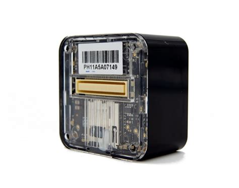
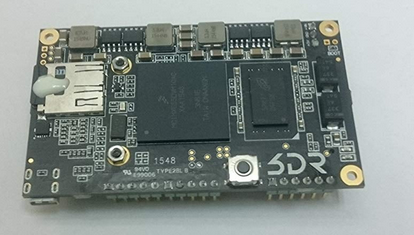
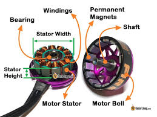
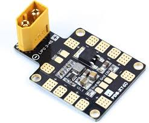

# UAV Hardware, Software & Cybersecurity

**Type:** Presentation
**Duration:** 60 minutes
**Section:** Day 1 – UAV & Drone

---

## Objectives

- Identify the major hardware components of a consumer/prosumer UAV
- Understand the software stack running on each component
- Map hardware and software components to cybersecurity considerations

---

## UAS Overview

A UAS is not a single device — it is a system of systems.

| ID | Subsystem Name | ID | Subsystem Name|
| :-- | :--- | :-- |---: |
| 1 | **Flight Computer** | 6 | **RC Receiver** |
| 2 | **Companion Computer** | 7 | **IMU (Inertial Measurement Unit)** |
| 3 | **Motors & ESC** | 8 | **GPS/GNSS Receiver** |
| 4 | **Power Distribution Board** | 9 | **ADS-B Receiver/Transmitter** |
| 5 | **Telemetry Radios** | 10 | **Camera / Gimbal** |

---

## 1. Flight Controller (Autopilot)

The **flight controller (FC)** is the brain of the drone. It stabilizes the aircraft, interprets RC commands, executes missions, and communicates with the GCS.

## Flight Controller Common Firmware:

| Firmware | Description |
|----------|-------------|
| **ArduPilot** | Open source, broad hardware support, large community |
| **PX4** | Open source, professional/commercial focus |
| **DJI Naza** | Proprietary, DJI drones |
| **Betaflight** | Open source, racing and freestyle FPV |

**Hardware platforms:** Pixhawk, Cube Orange, Holybro, MatekSys, SpeedyBee

**OS:** RTOS (NuttX for PX4/ArduPilot on bare metal) or Linux (ArduPilot on Linux)

---

## Flight Computer (Cybersecurity)
- Parameters stored in EEPROM — readable/writable via MAVLink with no authentication
- Serial console often accessible via UART with root-equivalent access
- No secure boot on most commercial flight controllers
- Firmware update via USB with no signature verification

---

## 2. Companion Computer

Many advanced drones pair the flight controller with a **companion computer** for higher-level processing.

## Companion Computer Examples:
- 3DR Solo: Freescale iMX6 (ARM Cortex-A9), runs Linux Yocto
- DJI Manifold: NVIDIA Jetson
- Generic: Raspberry Pi, NVIDIA Jetson Nano, Intel NUC

### Responsibilities:
- Payload processing (computer vision, object tracking)
- Advanced mission logic
- Telemetry forwarding between flight controller and GCS
- Running companion apps and scripts

---

## Companion Computer Cybersecurity:
- Full Linux environment — all Linux attack surface applies
- Often has SSH enabled with weak or default credentials
- WiFi access point hosted by companion computer
- Accessible from GCS network

---

## 3. Motors & ESC

**Brushless DC (BLDC) motors** are standard for consumer and commercial drones.

## ESC (Electronic Speed Controller):
- Converts DC power to 3-phase AC for the BLDC motor
- Receives PWM or DSHOT signal from flight controller
- Can be programmed via BLHeliSuite over USB or signal wire
- BLHeli32 supports firmware updates over the air via the flight controller

---

## ESC Cybersecurity:

- ESC firmware can be modified to alter motor behavior
- BLHeli passthrough allows reprogramming ESCs through the flight controller
- DoS: corrupted ESC signal causes motor failure in flight

---

## 4. Power Distribution Board & BEC

**PDB (Power Distribution Board):**
- Routes battery power to motors, ESC, and other components
- Some PDBs include a built-in voltage regulator

**BEC (Battery Eliminator Circuit):**
- Steps down battery voltage (11.1V / 14.8V) to regulated 5V or 12V
- Powers flight controller, servos, and accessories

## PDB Cybersecurity:
- Physical: access to power rails allows hardware implant
- Shared power bus means a shorted component can affect all subsystems

---

## 5. Telemetry Radio

**SiK Radios (RFDesign, HolyBro, 3DR):**
- 433 MHz (EU/Asia) or 915 MHz (USA)
- 250 mW typical output
- Bidirectional: carries MAVLink from drone to GCS
- Parameters: NET ID, AIR SPEED, DUTY CYCLE, ECC

## Telemetry Radio Cybersecurity:
- AES-128 encryption available but rarely configured
- Default NET ID (25) means any SiK radio can receive traffic
- Passive capture with HackRF or RTL-SDR
- Replay of captured MAVLink frames

---

## 6. RC Receiver

**RC protocols:**

| Protocol | Description |
|----------|-------------|
| **PWM** | One wire per channel, no feedback, analog |
| **PPM** | All channels on one wire, sequential pulses |
| **SBUS** | Frsky/Futaba serial protocol, inverted UART |
| **DSM2/DSMX** | Spektrum 2.4 GHz spread spectrum |
| **CRSF** | ExpressLRS/TBS Crossfire, bidirectional, encrypted |

## RC Cybersecurity:
- Older protocols (PWM, PPM, SBUS) have no authentication or encryption
- DSM2 vulnerable to replay attack: capture bind sequence, replay to take over
- DSMX: harder but still documented vulnerabilities
- RC jamming forces failsafe behavior (RTL, land, or hover)

---

## 7. IMU (Inertial Measurement Unit)

Sensors that measure the drone's physical state:

- **Accelerometers** – measure linear acceleration (3 axes)
- **Gyroscopes** – measure angular velocity (3 axes)
- **Magnetometer/Compass** – measure magnetic heading (3 axes)
- **Barometer** – measure altitude by air pressure

**Common IMU chips:** ICM-42688-P, ICM-20689, MPU-6000, MS5611

## IMU Cybersecurity:
- Sensor spoofing: acoustic injection (laser or sound waves at resonant frequency)
- Magnetic spoofing: external magnetic field corrupts heading
- Barometric spoofing: localized pressure changes (rare but demonstrated)

---

## 8. GPS / GNSS Receiver

Provides absolute position (latitude, longitude, altitude) and time.

**Satellite constellations:**
- GPS (US) – L1: 1575.42 MHz
- GLONASS (Russia)
- BeiDou (China)
- Galileo (EU)

**Common receivers:**
- u-blox NEO-7N (3DR Solo)
- u-blox M8/M9/F9 series

## GNSS Cybersecurity:
- GPS signals are unencrypted and unauthenticated — anyone can spoof them
- GPS spoofing demonstrated against DJI, commercial, and military drones
- Inertial navigation (dead reckoning) as fallback is limited

---

## 9. ADS-B/ Remote ID

**Automatic Dependent Surveillance-Broadcast (ADS-B):**
- 1090 MHz
- Broadcasts: ICAO address, position, altitude, velocity, callsign
- Standard in manned aviation; increasingly required for UAV

**ADS-B In** (receive only): drone listens for nearby aircraft, avoids collision
**ADS-B Out** (transmit): drone broadcasts its own position

## ADSB Cybersecurity:
- ADS-B is unauthenticated — trivially spoofable
- False aircraft injection causes GCS/autopilot alerts
- Suppression of own signal causes detection gap

---

## 10. Camera & Gimbal

**Camera types:**
- GoPro (WiFi-enabled, HTTP API)
- DJI integrated cameras
- Thermal / multispectral sensors
- FPV cameras (analog or digital)

**Gimbal:**
- 2-axis or 3-axis stabilization
- Controlled via MAVLink or dedicated serial protocol
- Some support pan/tilt from GCS

## Camera Cybersecurity:
- GoPro WiFi exposes HTTP API (port 80) — no authentication on older models
- Analog video downlink is unencrypted and eavesdroppable
- Digital video streams (RTP/RTSP) often unencrypted on local WiFi

---

## Assessment Summary by Component

| Component | Key Vulnerabilities |
|-----------|---------------------|
| Flight controller | UART shell, unsigned firmware, unauthenticated MAVLink |
| Companion computer | SSH default creds, open ports, no hardening |
| RC receiver | No encryption (PWM/PPM/SBUS), DSM2 replay |
| Telemetry radio | Unencrypted by default, global NET ID |
| GPS | Spoofable — unencrypted satellite signals |
| GoPro / camera | Unauthenticated HTTP API, unencrypted video |
| ESC | BLHeli passthrough, firmware modification |
