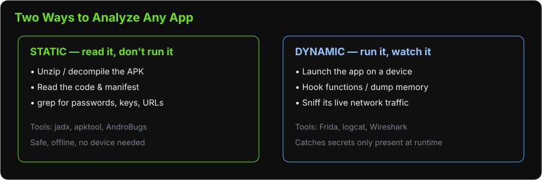

# Introduction to Android Cybersecurity

**Type:** Presentation
**Duration:** 30 minutes
**Section:** Day 1 – Ground Control

---

## Objectives

- Understand the Android security model as it applies to GCS applications
- Learn to use ADB (Android Debug Bridge) for device access
- Know the key tools for static and dynamic APK analysis
- Identify common vulnerabilities in Android GCS applications

---

## Why Android? The GCS Is an App

For most consumer drones, the Ground Control Station *is* a phone app (Solex, the Specta app, DJI Fly). That app holds the WiFi password to the drone, speaks MAVLink, and sometimes ships secrets baked right into it. So "hacking the drone" often starts with **hacking its app** — which is what this module and Lab 08 are about.

---

## Android Security Model

**Key concepts:**
- Each app runs in an isolated **sandbox** with a unique Linux UID — one app cannot read another's files. (Getting *around* this isolation is a big part of the lab.)
- Apps request **permissions** declared in AndroidManifest.xml — the manifest is the app's "table of contents," and reading it is always step 1.
- **Intents** are Android's messaging system between apps; a component marked `exported="true"` can be triggered by *other* apps — a common attack surface.
- **APK** (Android Package Kit) — the app itself: really just a **signed ZIP file** you can unzip and read.

**Two ways to analyze any app** — we do static first (safer, no device needed), then dynamic:



**Relevant to GCS apps:**
- Many GCS apps request dangerous permissions: LOCATION, CAMERA, STORAGE, INTERNET, BLUETOOTH
- Apps connecting to drones via WiFi may store credentials insecurely
- Apps may have network endpoints hard-coded in plaintext

---

## ADB: Android Debug Bridge

ADB is the primary tool for interacting with Android devices from a computer.

**Setup:**
```bash
# Enable Developer Options on the Android device:
# Settings → About Phone → Tap "Build Number" 7 times

# Enable USB Debugging:
# Settings → Developer Options → USB Debugging: ON

# Verify device is connected
adb devices
# Should show: <serial>  device
```

## Key ADB commands:

| Command | Purpose |
|---------|---------|
| `adb devices` | List connected devices |
| `adb shell` | Open interactive shell on device |
| `adb pull <remote> <local>` | Copy file from device |
| `adb push <local> <remote>` | Copy file to device |
| `adb install app.apk` | Install an APK |
| `adb logcat` | View real-time device logs |
| `adb backup -apk -all -f backup.ab` | Full device backup |
| `adb bugreport` | Collect diagnostic info |

## Extract an installed APK:

```bash
# Find package name
adb shell pm list packages | grep -i solex

# Get APK path
adb shell pm path com.solex.app

# Pull the APK
adb pull /data/app/com.solex.app-1/base.apk solex.apk
```

---

## Static Analysis: APKtool 

**What is smali?** Android apps are written in Java/Kotlin, compiled to **Dalvik bytecode** (the `.dex` inside the APK). We can't get the exact original source back, but two tools get us close: **apktool** turns the bytecode into *smali* (a readable assembly-like form, great for resources and repackaging), while **jadx** (next slide) reconstructs near-Java source that is much easier to read. Use jadx to *understand*, apktool to *modify and repackage*.

**APKtool** – decompiles APK to smali bytecode and resources

```bash
# Decompile
apktool d solex.apk -o solex_decoded/

# Output:
# solex_decoded/
#   AndroidManifest.xml   (permissions, activities, services)
#   res/                  (layouts, strings, drawables)
#   smali/                (Dalvik bytecode — harder to read)
```
## Static Analysis: JADX

**Jadx** – decompiles APK directly to readable Java source

```bash
# GUI version
jadx-gui solex.apk

# CLI version
jadx solex.apk -d solex_java/
```

## What to look for in static analysis:

```bash
# Hardcoded credentials, API keys, secrets
grep -r "password\|secret\|key\|token" solex_java/ --include="*.java"

# Network endpoints
grep -r "http\|https\|ftp" solex_java/ --include="*.java"

# Interesting permissions (AndroidManifest.xml)
grep "uses-permission" solex_decoded/AndroidManifest.xml

# Exported components (potential attack surface)
grep "exported=\"true\"" solex_decoded/AndroidManifest.xml
```

---

## Dynamic Analysis: Frida

**Frida** is a dynamic instrumentation toolkit that allows you to inject JavaScript into running Android processes.

**Plain-English:** Frida lets you pause a running app, reach inside it, and read or change what a function is doing *live* — for example, printing every password the app checks, or dumping its memory to disk. In Lab 08 we use exactly this to scrape a memory dump and recover a password. "Instrumentation" just means *adding your own observation points into someone else's running code*.

**Setup:**
```bash
# Download frida-server for Android ARM
# Transfer to device and run as root
adb push frida-server /data/local/tmp/
adb shell "chmod +x /data/local/tmp/frida-server"
adb shell "/data/local/tmp/frida-server &"

# On laptop: enumerate running apps
frida-ps -U

# Attach to a running app
frida -U -n "com.solex.app" -e "Java.perform(function(){ ... })"
```

## Common Frida hooks:**
- Hook `SharedPreferences.getString()` — intercept stored values
- Hook `OkHttpClient` or `HttpURLConnection` — capture network requests
- Hook cryptographic functions — extract keys
- Bypass SSL pinning to intercept HTTPS traffic

---

## Common Vulnerabilities in GCS Android Apps

| Vulnerability | Where Found | Impact |
|---------------|------------|--------|
| Hardcoded credentials | Java source, strings.xml | Full system access |
| Insecure data storage | SharedPreferences, SQLite, SD card | Credential theft |
| Unencrypted network traffic | HTTP endpoints | MITM, credential capture |
| Exported activities | AndroidManifest.xml | Unauthorized access |
| Weak SSL/TLS (no cert pinning) | OkHttp, Retrofit config | MITM attacks |
| Excessive permissions | AndroidManifest.xml | Privacy violation |
| Logs with sensitive data | adb logcat | Information disclosure |

---

## AndroBugs Framework

**AndroBugs** is an automated Android vulnerability scanner.

```bash
python androBugs.py -f solex.apk -t master
```

Reports vulnerabilities across categories:
- Security permission issues
- Exported components
- Hardcoded sensitive strings
- Weak cryptography
- Insecure random number generation
- SQLite injection risks

---

## Summary

| Tool | Use |
|------|-----|
| ADB | Device access, APK extraction, shell, logs |
| APKtool | Decompile to smali + resources |
| Jadx | Decompile to readable Java |
| AndroBugs | Automated static vulnerability scan |
| Frida | Runtime hooking and dynamic analysis |
| Wireshark | Capture network traffic from the device |
