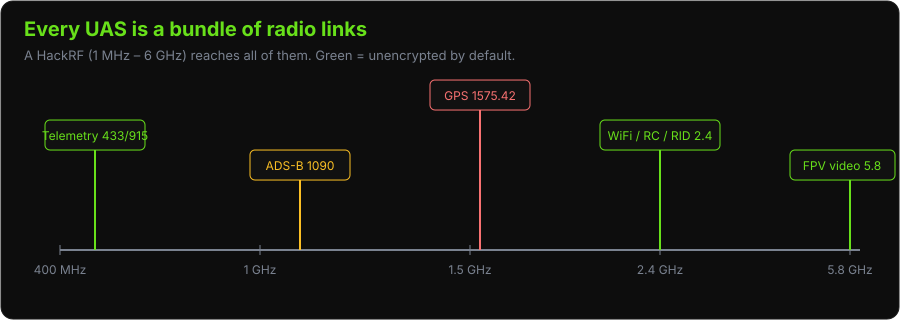
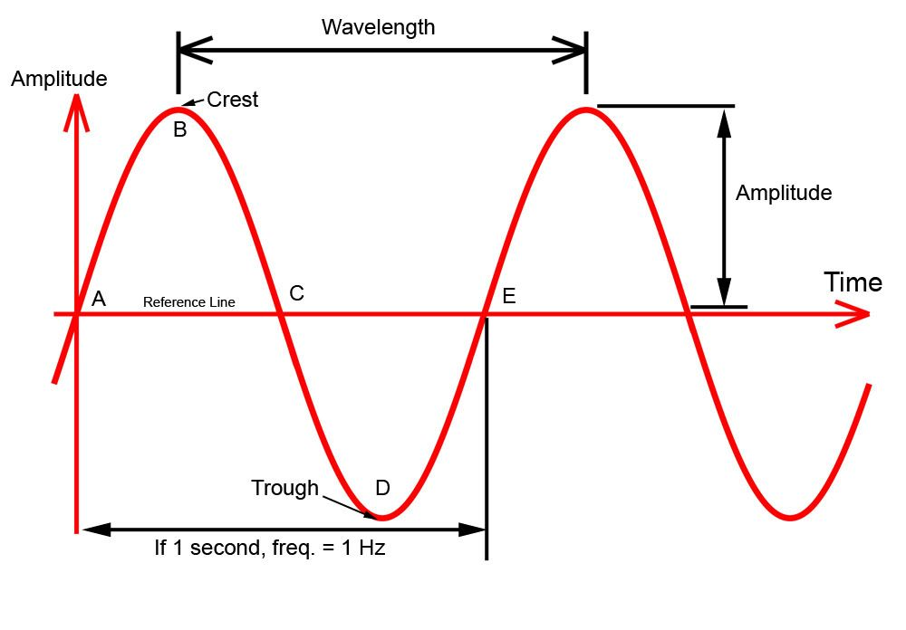
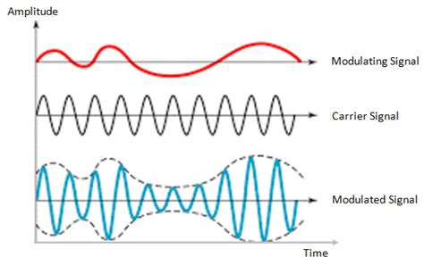
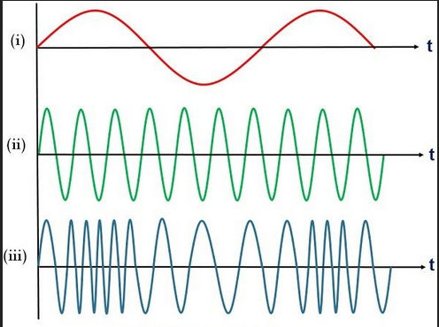
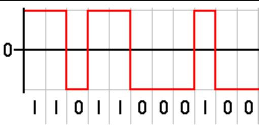
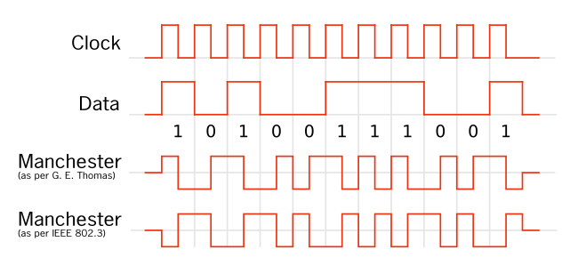
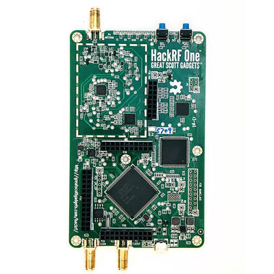
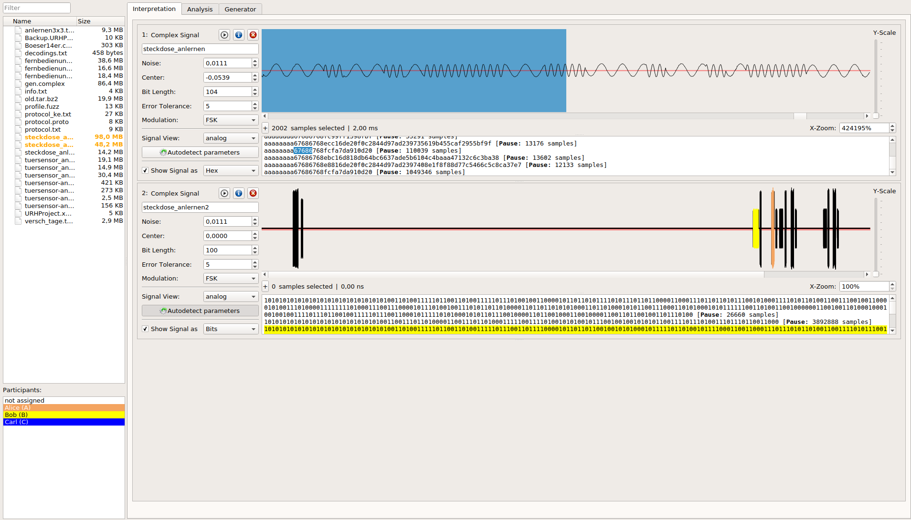

# UAS RF Communications

**Type:** Presentation
**Duration:** 60 minutes
**Section:** Day 2 – RF Communications

---

## Objectives

- Understand basic RF modulation schemes and binary encoding
- Identify all RF links in a UAS system and their frequencies
- Learn SDR hardware options and their capabilities
- Survey the key software tools for RF analysis

---

## Welcome to Day 2: The Invisible Attack Surface

Yesterday everything was a *cable or a network* you could see. Today we go after the part you **can't** see: **radio**. Every drone is surrounded by a cloud of radio signals — control, telemetry, GPS, video, Remote ID — and most of them are unencrypted. If you can receive a signal, you can often read it; if you can transmit, you can often spoof it.

**The one piece of gear that makes this possible** is the **SDR (Software-Defined Radio)** — a USB device (your HackRF) that can tune to almost any frequency and hand the raw signal to software. Before SDRs, each attack needed custom hardware; now one $300 box covers everything from GPS to 5.8 GHz video.

Don't worry if RF feels unfamiliar — the next few slides build it up from zero.

---

## A Brief History of RF

| Year | Milestone |
|------|-----------|
| 1831 | Faraday discovers electromagnetic induction |
| 1864 | Maxwell's 4 equations describe EM fields |
| 1888 | Hertz demonstrates EM waves in free space |
| 1894 | Marconi demonstrates wireless telegraphy |
| 1900 | Fessenden transmits voice over radio |
| 1933 | Armstrong patents FM radio |
| 1987 | GPS satellite constellation launched |
| 1994 | US Army / DARPA begin Software Defined Radio work |
| 2010 | RTL-SDR discovered — cheap USB TV tuner repurposed as SDR |

---

## RF in a UAS System

Every UAS has multiple RF links — each one is a potential attack surface:



| Link | Frequency | Protocol | Direction |
|------|-----------|----------|-----------|
| RC Control | 2.4 GHz | DSM2/DSMX, SBUS, CRSF | GCS → UAV |
| Telemetry | 433 / 915 MHz | SiK (MAVLink) | Bidirectional |
| WiFi GCS Link | 2.4 / 5 GHz | 802.11n/ac | Bidirectional |
| FPV Video | 5.8 GHz (analog) | NTSC/PAL | UAV → GCS |
| GPS | L1: 1575.42 MHz | NMEA / UBX | Satellite → UAV |
| ADS-B | 1090 MHz | Mode S | Bidirectional |
| Remote ID | 2.4 GHz / BLE | Wi-Fi Beacon / BLE 4/5 | UAV → World |

---

## RF Fundamentals: The Sine Wave

All RF signals are based on sinusoidal waves characterized by:



- **Amplitude** — signal strength (voltage)
- **Frequency** — oscillations per second (Hz)
- **Phase** — position in the cycle (degrees)
- **Wavelength** — physical length of one cycle (λ = c/f)

**Key relationships:**
- Higher frequency → shorter wavelength → shorter range (in general)
- Higher amplitude → stronger signal → more power consumption
- Phase differences between signals enable MIMO and diversity techniques

---

## Modulation Schemes 1/2

**Modulation** is the process of encoding information onto a carrier wave.

**Plain-English:** a plain sine wave carries no information — it's a steady hum. To send data you have to *change* something about that hum in a pattern the receiver can read back. You only have three things you *can* change: its height (**amplitude**), its pitch (**frequency**), or its timing (**phase**). Every scheme below is just a different combination of those three knobs. "AM radio" wiggles amplitude; "FM radio" wiggles frequency — same idea, applied to drones.

<div class="two-col">
<div><br><em>AM — data rides in the wave's height.</em></div>
<div><br><em>FM — data rides in the wave's frequency (used by SiK radios).</em></div>
</div>

### Analog Modulations

| Type | Full Name | How It Works | Used In |
|------|-----------|--------------|---------|
| AM | Amplitude Modulation | Varies amplitude | AM radio, analog video |
| FM | Frequency Modulation | Varies frequency | FM radio, SiK radios |
| PM | Phase Modulation | Varies phase | Basis for digital schemes |

--- 
## Modulation Schemes 2/2

### Digital Modulations

| Type | Full Name | How It Works | Bits/Symbol | Used In |
|------|-----------|--------------|-------------|---------|
| OOK | On-Off Keying | Signal on = 1, off = 0 | 1 | Morse code, simple RF |
| ASK | Amplitude Shift Keying | 2+ amplitude levels | 1+ | RFID |
| FSK | Frequency Shift Keying | 2+ frequency levels | 1+ | SiK radios, some RC |
| QPSK | Quadrature PSK | 4 phase states | 2 | WiFi, cellular, GPS |
| QAM | Quadrature Amplitude Mod. | Amplitude + phase | 4-8+ | Cable, WiFi (64/256 QAM) |

**Higher-order modulations (64-QAM, 256-QAM):**
- Pack more bits per symbol
- More sensitive to noise — require cleaner channel
- Used in WiFi (802.11ac/ax) when signal is strong

---

## Binary Encoding Schemes

After modulation, data bits must be encoded for reliable transmission:

| Encoding | Description | Use Case |
|----------|-------------|---------|
| **NRZ** (Non-Return to Zero) | High = 1, Low = 0, no transition required | Simple serial |
| **Manchester** | Transition in middle of each bit period (↓ = 1, ↑ = 0) | Ethernet (10BASE-T), some RC |
| **Differential Manchester** | Transition = 0, No transition = 1 | Token Ring, robust links |

<div class="two-col">
<div><br><em>NRZ — high = 1, low = 0. Simple, but a long run of 1s has no edges to sync on.</em></div>
<div><br><em>Manchester — every bit has a mid-bit transition, so the clock rides along with the data.</em></div>
</div>

**Manchester encoding advantage:** Clock recovery is built into the signal — no separate clock line needed. (URH in Lab 16 lets you pick the encoding when decoding a capture — now you know what those options mean.)

---

## Software-Defined Radio (SDR)

> Software-defined radio (SDR) is a radio communication system where components that conventionally have been implemented in analog hardware (mixers, filters, amplifiers, modulators/demodulators) are instead implemented by software on a computer or embedded system.

**Why SDR matters for UAS security:**
- Can receive (and sometimes transmit) any RF frequency the hardware supports
- Cheap hardware enables passive monitoring of all UAS RF links
- Enables replay attacks, signal analysis, and protocol reverse engineering

**What is "I/Q data"?** You'll see this term everywhere in RF tools. An SDR doesn't record "audio" — it records two numbers many millions of times per second: **I** (in-phase) and **Q** (quadrature). Together they capture the amplitude *and* phase of the signal at each instant, which is enough to reconstruct *any* modulation in software. When a tool saves a `.raw` or `.iq` file, that's what's inside. You don't need the math — just know I/Q = "the raw radio, as numbers."

---

## SDR Hardware Comparison

| Hardware | Freq Range | Mode | BW | ADC | Cost |
|----------|------------|------|----|-----|------|
| **RTL-SDR** | 24–1766 MHz | RX only | 3.2 MHz | 8-bit | ~$30 |
| **HackRF One** | 1 MHz–6 GHz | Half-duplex TX/RX | 20 MHz | 8-bit | ~$300 |
| **ADALM Pluto** | 325 MHz–3.8 GHz | Full-duplex | 20 MHz | 12-bit | ~$200 |
| **BladeRF xA9** | 70 MHz–6 GHz | Full-duplex | 61 MHz | 12-bit | ~$1,000 |
| **USRP B210** | 70 MHz–6 GHz | Full-duplex | 56 MHz | 12-bit | ~$2,200 |

---

## For this workshop:



- **HackRF One** — main tool for TX/RX experiments
- **RTL-SDR** — passive monitoring and ADS-B

The **HackRF One** is the single most important piece of gear on Day 2. That one board can receive (and transmit) anything from 1 MHz to 6 GHz — telemetry, GPS, Remote ID, and 5.8 GHz video — so every RF lab uses it.

**Key HackRF specs:**
- 1 MHz to 6 GHz — covers all UAS RF links
- Half-duplex: transmit or receive, not simultaneously
- Up to 20 million samples per second
- 8-bit I/Q samples
- USB 2.0 Micro-B

---

## RF Software Tools

### GQRX – Signal Visualization

GQRX is a general-purpose SDR receiver frontend.

- **Waterfall display** — frequency vs. time, color = signal strength
- **Power spectrum** — frequency vs. amplitude at a moment in time
- Supports: RTL-SDR, HackRF, USRP, ADALM Pluto
- Can save IQ recordings to file for offline analysis

```bash
gqrx
# Configure device: HackRF or RTL-SDR
# Set center frequency: 915 MHz (SiK telemetry)
# Set sample rate: 2 MSPS
# Observe the waterfall for telemetry bursts
```

### Universal Radio Hacker (URH) – Signal Analysis



URH is a full-featured signal analysis and decoding tool. It takes you the last mile — from "I captured a mystery signal" to "here are the actual 1s and 0s." You mark where the signal is, tell URH the modulation (FSK/ASK) and bit rate, and it demodulates the raw I/Q into bits you can read.

```bash
urh
# Record an IQ capture
# Signal → Detect parameters (modulation, bit rate, preamble)
# Analysis → Demodulate
# Protocol → Decode (NRZ, Manchester, etc.)
```

### Inspectrum – IQ File Viewer

- Visualizes large IQ capture files
- Zoom and pan across time
- Cursor measurement tools

### Baudline – Signal Analysis

- Advanced spectral analysis
- Reads IQ files
- Supports multiple display formats (spectrogram, waveform, histogram)

---

## Capturing UAS RF Links

### SiK Telemetry (915 MHz)

```bash
# In GQRX:
# Frequency: 915.000 MHz
# Mode: Narrowband FM
# Filter: 5 kHz
# Look for regular bursts when drone is connected to GCS
```

### WiFi GCS Link (2.4 GHz)

```bash
# Standard WiFi monitoring with airmon-ng
sudo airmon-ng start wlan0
sudo airodump-ng wlan0mon --band g --bssid <Solo_MAC>
```

### GPS (1575.42 MHz)

```bash
# RTL-SDR can receive GPS L1 with appropriate antenna
# Set GQRX to 1575.42 MHz
# Signals will be very weak — use directional antenna if possible
```

### ADS-B (1090 MHz)

```bash
# Dump1090 — ADS-B decoder
dump1090 --net --interactive
# Open browser: http://localhost:8080
# Observe aircraft in the area
```

---

## Key Takeaways

- Every UAS has 5-7 distinct RF links, each with different security properties
- SDR hardware starting at $30 can receive most UAS frequencies
- Signal analysis tools (GQRX, URH) can demodulate and decode captured RF
- Unencrypted RF links (SiK default, analog video, GPS) are passively interceptable
- Encrypted links can still be jammed, replayed, or spoofed if not properly authenticated
