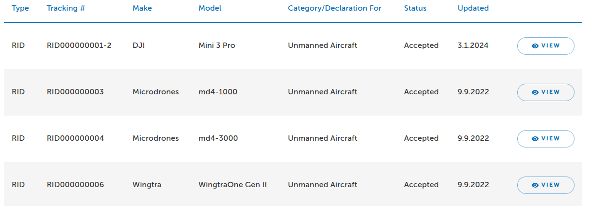
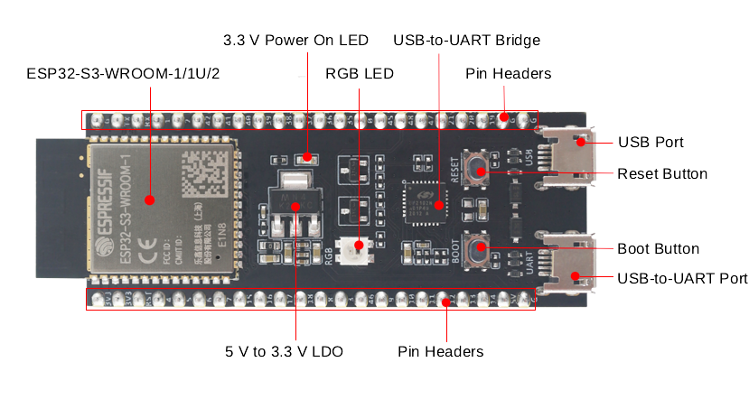
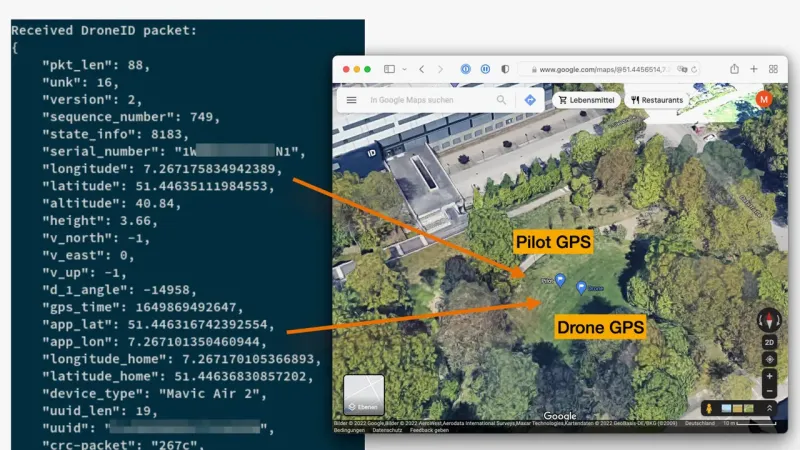
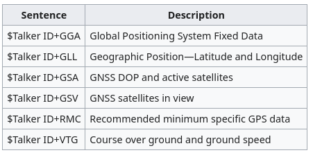

# DroneID & Remote ID

**Type:** Presentation
**Duration:** 30 minutes
**Section:** Day 2 – RF Communications

---

## Objectives

- Understand the FAA Remote ID requirement and what data is broadcast
- Compare DJI DroneID and the Open Drone ID standard
- Understand GPS/GNSS as a foundational UAS technology and attack vector
- Identify Remote ID security vulnerabilities and spoofing techniques

---

## What is Remote ID?

> Remote ID is the ability of a drone in flight to provide identification and location information that can be received by other people through a broadcast signal.
> — FAA

**Beginner framing:** Remote ID is a **digital license plate** for drones. Just as a car broadcasts its plate to anyone who looks, a drone must now continuously announce *who it is and where it (and its pilot) are* — over WiFi or Bluetooth — so police and other aircraft can identify it. Great for accountability; a privacy and spoofing problem for security, because that broadcast is **plaintext and unsigned**.

**Regulatory basis (USA):**
- FAA 14 CFR **Part 89** — the Remote ID rule
- Manufacturers had to build RID into new drones by **Sept 16, 2022**
- Operator compliance date was **Sept 16, 2023**, with FAA enforcement discretion extended to **March 16, 2024**
- Applies to all drones requiring registration (**>250 g**), from takeoff to shutdown

**Why it matters for security:**
- Remote ID is designed to identify drones — but it is **not authenticated** (nothing proves the broadcast is genuine)
- Remote ID data can be **spoofed** (fake drones), **suppressed** (go dark), or used to **track the operator's location**

---

## Remote ID: What is Broadcast

From takeoff to shutdown, Remote ID broadcasts:

| Data Field | Description |
|------------|-------------|
| Drone serial number | FAA-registered UAS ID |
| Drone location | GPS latitude / longitude |
| Drone altitude | Above ground or sea level |
| Drone velocity | Speed and direction |
| Takeoff location | GPS coordinates of launch point |
| Time mark | UTC timestamp |

**Broadcast methods:**
- **WiFi Beacon** (802.11n/ac/ax) — 2.4 or 5 GHz
- **Bluetooth 4 LE advertising** (BLE 4 Legacy or Extended Advertising)
- **Bluetooth 5 Long Range** (for extended range)

---

## FAA Compliance Database



The FAA maintains a searchable database of Remote ID compliant drones:
- `https://uasdoc.faa.gov/listDocs?docType=rid&status=accepted`
- Searchable by serial number, manufacturer, and model
- Used to verify whether a drone's Remote ID serial number is legitimate

**Security implication:** An attacker can broadcast a spoofed serial number that appears in the FAA database — creating a false identity for an unauthorized drone.

---

## ArduPilot ArduRemoteID

ArduPilot supports Remote ID via an external ESP32 module:



- **ESP32-C3** or **ESP32-S3** development boards (this is the exact board you flash and sniff in Lab 14)
- Connected to autopilot via MAVLink (USB, serial, or DroneCAN)
- Receives position and identity data from ArduPilot over MAVLink
- Broadcasts via WiFi Beacon and/or BLE

**Firmware:** `ArduRemoteID-ESP32C3_DEV.bin` (provided in workshop files)

```bash
# Flash the ESP32-C3 with ArduRemoteID
esptool.py --port /dev/ttyUSB0 write_flash 0x0 ArduRemoteID-ESP32C3_DEV.bin
```

---

## DJI DroneID

**DJI DroneID** is DJI's proprietary Remote ID implementation.



- Broadcasts on WiFi channel alongside the drone's control link
- Initially undocumented — reverse engineered by the community (2023)
- Includes: drone serial number, location, velocity, pilot location, home location

**Security research findings:**
- DroneID was decoded by researchers without DJI authorization
- Location data is broadcast unencrypted — **including the operator's GPS location**, not just the drone's
- Suppression tools exist (e.g., CIAJeepDoors) but are unreliable:
  - Does not fully stop broadcasts
  - Broadcasts NULL data / "fakeSN"
  - Some location packets may still leak

> **Landmark study:** In *"Drone Security and the Mysterious Case of DJI's DroneID"* (NDSS 2023), researchers from **Ruhr University Bochum** and **CISPA** reverse-engineered the DroneID radio protocol and showed the data is unencrypted — meaning anyone with a cheap SDR can decode a DJI drone's position *and* pinpoint its pilot. This is the single best real-world example of why "identification without authentication or encryption" is a security problem.

---

## Open Drone ID Standard

**Open Drone ID** is the open standard (ASTM F3411) implemented by non-DJI manufacturers.

**Protocol layers:**
- WiFi Beacon (802.11 management frames)
- Bluetooth 4 Legacy Advertising
- Bluetooth 5 Long Range + Extended Advertising

**Relevant implementations:**
- `opendroneid/transmitter-linux` — transmit from a Raspberry Pi or laptop
- ArduRemoteID — transmit from ESP32 attached to drone
- OpenDroneID Android app — receive and display Remote ID data

---

## Remote ID: Security Vulnerabilities

| Vulnerability | Description | Impact |
|---------------|-------------|--------|
| No authentication | Serial number is not cryptographically signed | Spoofing |
| Unencrypted | All data is in plaintext | Tracking |
| Takeoff location broadcast | Reveals operator's location | Privacy |
| Suppression tools | Broadcasting NULL/fake data | Evasion |
| Replay | Rebroadcast a captured packet | Identity theft |

---

## GPS/GNSS Review

Remote ID relies on GPS for position data. Understanding GPS is key.

**Constellations and frequencies:**

| System | Country | L1 Frequency |
|--------|---------|-------------|
| GPS | USA | 1575.42 MHz |
| GLONASS | Russia | 1598–1606 MHz |
| BeiDou | China | 1561.1 MHz |
| Galileo | EU | 1575.42 MHz |
| QZSS | Japan | 1575.42 MHz |



**NMEA 0183 protocol:**
- ASCII-based serial protocol (RS-422, 4800/38400 baud)
- Standard output from consumer GNSS receivers
- Messages: `$GPGGA` (position), `$GPRMC` (recommended minimum), `$GPGSV` (satellite info)

**Example:**
```
$GPGGA,123519,4807.038,N,01131.000,E,1,08,0.9,545.4,M,46.9,M,,*47
```

**u-blox u-center:**
- GUI configuration tool for u-blox GNSS modules (NEO-7, M8, M9)
- Can configure satellite constellations, output rate, protocols
- Used to inspect 3DR Solo GPS module behavior

---

## GPS Spoofing

**Why GPS is so easy to fool:** the satellites are ~20,000 km away, so by the time their signal reaches the ground it is *incredibly* faint — about **-130 dBm**, weaker than the background noise. The receiver just trusts the strongest matching signal it hears. An attacker on the ground, only meters away, can easily transmit a **stronger fake** — and the drone happily believes it. There's no password on GPS to check.

GPS signals are:
- Unencrypted
- Unauthenticated
- Very weak (-130 dBm at receiver)

**Spoofing attack:**
- Transmit stronger false GPS signals on 1575.42 MHz
- The receiver locks onto the spoofed signal
- Drone flies to spoofed coordinates or reports false position in Remote ID

**Tools:** SDR (HackRF or USRP), GPS signal generation software (e.g., gps-sdr-sim)

**Defenses:**
- Multi-constellation GNSS (harder to spoof all simultaneously)
- Inertial navigation fallback
- Drone-to-drone cooperative positioning
- Galileo OSNMA (Open Service Navigation Message Authentication) — in rollout

---

## Summary

| Topic | Key Point |
|-------|-----------|
| Remote ID | FAA-mandated broadcast — serial, location, velocity, takeoff point |
| Authentication | None — Remote ID serial numbers are spoofable |
| DJI DroneID | Reverse engineered — suppression tools exist but unreliable |
| Open Drone ID | ASTM standard — WiFi Beacon / BLE |
| GPS | Unencrypted and unauthenticated — spoofable with SDR |
| NMEA 0183 | Standard GPS output format — used in 3DR Solo |
