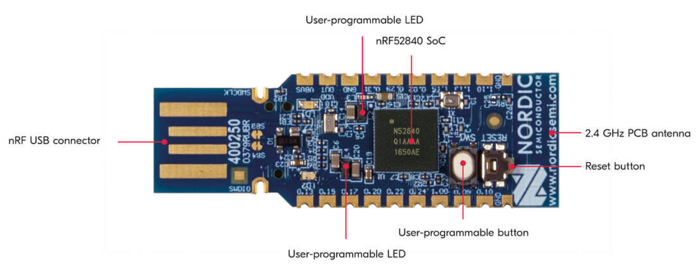
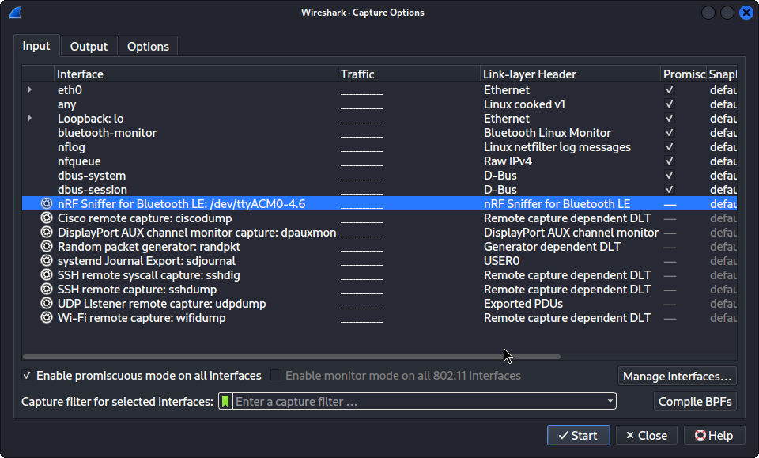
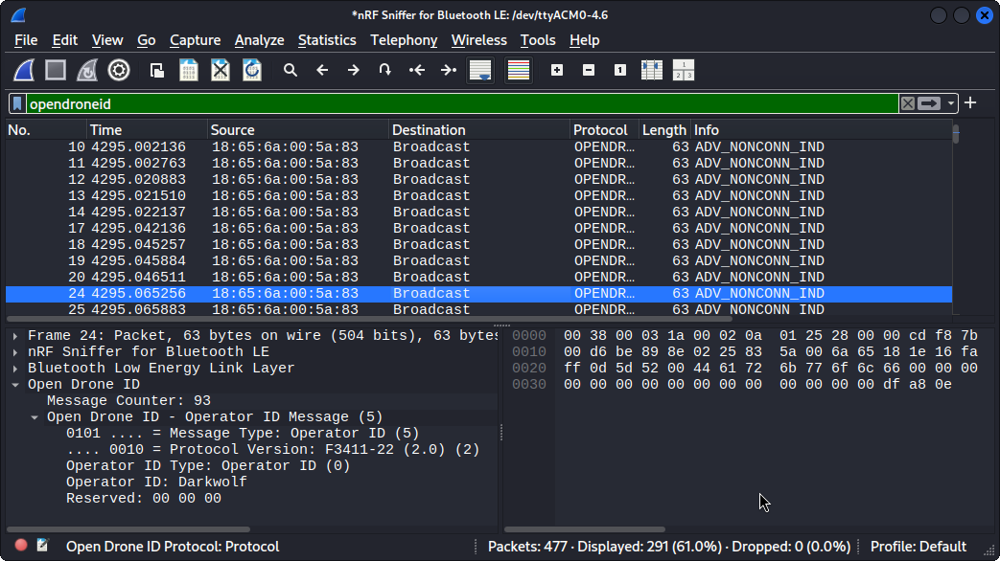
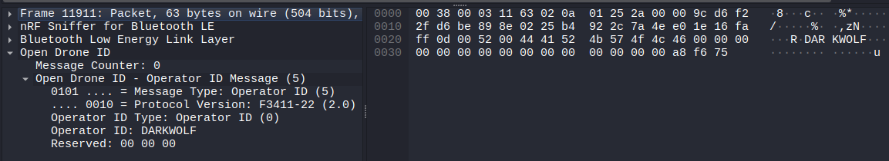

# Lab: Remote ID

**Type:** Lab
**Duration:** 30 minutes
**Section:** Day 2 – RF Communications

---

## Objectives

- Transmit Open Drone ID packets via WiFi Beacon and/or Bluetooth
- Receive and observe Remote ID broadcasts with a smartphone or sniffer
- Observe the spoofed Remote ID data in Wireshark

---
## Setup VirtualBox for NRF USB Passthrough

* In VirtualBox Manager, Select  
  * Kali-linux \-\> Settings \-\> USB  
* Insert nRF 52840 dongle in USB port on host laptop  
* Select the \[+\] icon on the right hand of the USB panel  
* Select ZEPHYR nRF Sniffer in the list  
* Select \[OK\] on the bottom of the USB panel



##  Lab Setup Wireshark for OpenDroneID

```bash
mkdir \-p \~/.local/lib/wireshark/plugins/  
cd \~/.local/lib/wireshark/plugins/  
git clone [https://github.com/opendroneid/wireshark-dissector](https://github.com/opendroneid/wireshark-dissector)
```
## Verify OpenDroneID

* Start wireshark  
* Select Help \-\> About Wireshark \> Plugins  
* Verify the entry for opendroneid-dissector.lua is present in the plugin list

## Setup Wireshark for NRF BLE Sniffer

* Download nrfutil  
* Run the following commands  
 
``` bash
 mkdir \-p \~/.local/lib/wireshark/extcap  
 ./nrfutil install completion  
 ./nrfutil install device  
 ./nrfutil install ble-sniffer  
 ./nrfutil ble-sniffer bootstrap
```

## Verify Wireshark NRF BLE Sniffer Device

* Start a BLE RemoteID device  
* Open Wireshark  
* On the Capture Splash page, select  
  * NRF Sniffer for Bluetooth LE:/dev/ttyACMxxxx  
* In the filter, enter *opendroneid*  
* Verify you are receiving opendrone id packets  
* Stop the packet capture 

## Flash nRF52840

Initially, the nRF5280 is delivered in DFU bootloader mode.

* TBD. Manually set DFU bootloader mode (button stuff)

In VirtualBox, add the nRF 52840 in bootloader mode

* Settings \> USB \> \[+\] (add) \-\> Nordic Semiconductor Open DFU Bootloader 

To flash, you will need nrfutil setup in Kali above. Open a terminal window and run the following commands
```bash
nrfutil device list*  
#  * Note the serial number  
#    * For this example: DBE9A7B81450  

#  Verify bootloader mode  
nrfutil ble-sniffer bootstrap
 # Note the path for the blesniffer firmware for nrf52840  
 # /home/kali/.nrfutil/share/nrfutil-ble-sniffer/firmware/sniffer\_nrf52840dongle\_nrf52840\_4.1.1.zip  
nrfutil device program --firmware /home/kali/.nrfutil/share/nrfutil-ble-sniffer/firmware/sniffer_nrf52840dongle_nrf52840_4.1.1.zip --serial-number DBE9A7B81450  
#  * You should see a progress bar.  
#  * Wait for completion
```
## Lab: Wireshark

- Open terminal window and type in *`wireshark`*
- Double click *`nRF Sniffer for Bluetooth LE`*



## Lab: Wireshark

- In the filter, type *opendroneid*


## Lab: Wireshark

- In the filter, type *opendroneid.message.operatorid*
- In the lower left window of wireshark, expand the packet fields to read the *operator id*
- Displays the operator id for this drone is *DARKWOLF*


## References

[https://docs.nordicsemi.com/bundle/nrfutil/page/README.html](https://docs.nordicsemi.com/bundle/nrfutil/page/README.html)  
[https://www.nordicsemi.com/Products/Development-tools/nRF-Util](https://www.nordicsemi.com/Products/Development-tools/nRF-Util)

## Notes

*“Regarding minimum RID requirements, it's "(Wi-Fi Beacon OR (BT5 AND BT4))". This is defined in the RID MOC to the Part 89 rule.”*  
https://github.com/opendroneid/transmitter-linux/issues/12\#issuecomment-1474298494

Hcitool supported specs  
sudo hcitool \-i hci0 cmd 0x4 0x3  
[https://stackoverflow.com/questions/59237661/hcitool-lescan-fails-on-ubuntu](https://stackoverflow.com/questions/59237661/hcitool-lescan-fails-on-ubuntu)

```
On BBB: 01 03 10 00 FF FE 2F FE DB FF 7B 87

                                       Byte  Bit  
32 EV4 packets                            		4   0  
33 EV5 packets                            		4   1  
34 Reserved for future use                		4   2  
35 AFH capable Peripheral                 	4   3  
36 AFH classification Peripheral          	4   4  
37 BR/EDR Not Supported                   	4   5  
38 LE Supported (Controller)              	4   6  
39 3-slot Enhanced Data Rate ACL packets  4   7

DB \-\> 11011011
```