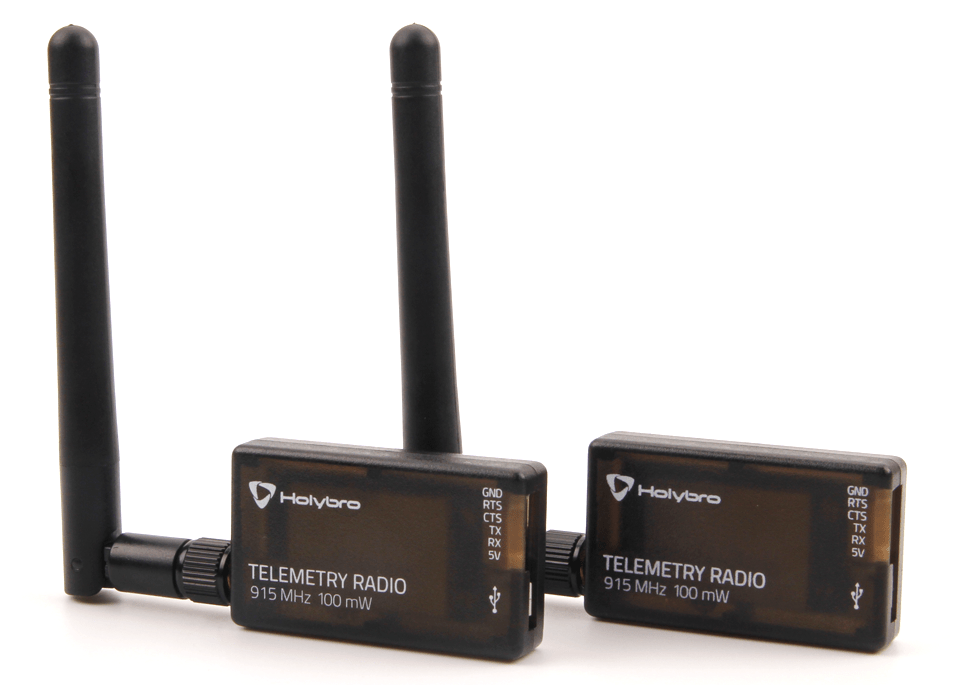

# SiK Telemetry Radios

**Type:** Presentation
**Duration:** 30 minutes
**Section:** Day 2 – RF Communications

---

## Objectives

- Understand the SiK radio architecture and its role in UAV telemetry
- Identify the key configuration parameters and their security implications
- Explain how MAVLink data flows over the SiK link
- Describe how an attacker can passively eavesdrop on SiK telemetry

---

## What is a SiK Radio?

**SiK** is an open-source firmware for small 915 MHz and 433 MHz telemetry radios used in UAVs.

**Original development:** 3DR (now open-source community)

**Hardware:** SiLabs Si1000 microcontroller + RF transceiver



---
## Common hardware implementations:
- 3DR Radio v1/v2 (original)
- RFDesign RFD900 (longer range)
- HolyBro SiK Telemetry Radio (current consumer version)
- mRo SiK Radio

**Physical connectors:**
- **Air side:** connected to the UAV flight controller via UART (JST-GH or Molex)
- **Ground side:** connects to the GCS laptop via USB (appears as `/dev/ttyUSB0`)

---

## SiK Frequency Bands

| Region | Frequency | Notes |
|--------|-----------|-------|
| USA | 900–928 MHz (ISM) | FCC Part 15.247 |
| Europe | 433 MHz | ETSI EN 300 220 |
| Australia | 915–928 MHz | ACMA Class license |

**Transmit power:** Up to +20 dBm (100 mW) typical; RFD900 up to +30 dBm (1W)

**Range:** 300m – 40km depending on antenna and power

---

## SiK Protocol Overview

SiK radios create a transparent serial link — they are invisible to the MAVLink stack.
**How it works:**
1. Air radio receives bytes on its UART from the flight controller
2. Data is packetized and transmitted over 915 MHz using FHSS (Frequency Hopping Spread Spectrum)
3. Ground radio receives packets, reassembles, and outputs bytes to GCS over USB serial
4. GCS application (QGroundControl, MAVProxy) reads MAVLink from the USB serial port

**From the GCS perspective:** the radio link is transparent — it looks like a direct serial connection to the flight controller.

---

## Key SiK Parameters

Parameters are configured using AT commands over the serial port (similar to a modem):

```bash
# Connect to SiK radio
minicom -D /dev/ttyUSB0 -b 57600

# Enter AT command mode (type +++ with no newline)
+++

# Read all parameters
ATI5

# Common parameters:
# S1: SERIAL_SPEED (57600 default)
# S3: AIR_SPEED (64 kbps default)
# S5: NUM_CHANNELS (50 FHSS channels)
# S6: DUTY_CYCLE (100% default)
# S7: LBT_RSSI (Listen Before Talk)
# S9: MAVLINK (1 = MAVLink framing)
# S10: OPPRESEND (0 = off)
# S15: ENCRYPT_LEVEL (0 = none)
# S16: ENCRYPTION_KEY (32 hex chars)
```

---

## NET ID: The Critical Security Parameter

**NET ID** (`S3` — actually part of FHSS configuration) determines which radio network this device belongs to.

Two SiK radios communicate only if they have the same NET ID.

**Default NET ID: 25**

>**Security implication:** Any SiK radio with NET ID 25 will receive all traffic from any other SiK radio with NET ID 25. 

```bash
# View NET ID
ATI5
# Look for: S3: NET_ID=25

# Change NET ID
ATS3=42   # Set to 42
AT&W      # Write to EEPROM
ATZ       # Reboot radio
```

---

## Encryption: Available but Rarely Used

SiK supports **AES-128** encryption:

```bash
# Enable encryption
ATS15=1         # Set encryption level to 1 (AES-128)
ATS16=AABBCCDDEEFF00112233445566778899  # 32-char hex key
AT&W            # Write to EEPROM
ATZ             # Reboot

# Both air and ground radio must use the same key
```

**Why encryption is rarely deployed:**
- Requires manual key management (no key exchange protocol)
- AES key must be provisioned on both radios
- No documentation in most manufacturer quick-start guides
- Default is always off

---

## Frequency Hopping Spread Spectrum (FHSS)

SiK uses FHSS to improve reliability and reduce interference:

- Hops between 50 channels in the 900 MHz band
- Hop sequence is deterministic based on NET ID
- Both radios must be synchronized to the same sequence

>**Security implication:** FHSS provides modest obscurity but not security. An attacker with HackRF:
- Can scan all 50 channels to find active hops
- Can reconstruct the hop sequence after observing a few hops
- Can capture full traffic with a wideband capture (20 MHz bandwidth covers the whole band)

---

## SiK Eavesdropping Attack

**Passive eavesdropping** requires:
1. HackRF One (covers 900 MHz band)
2. GQRX or URH for signal capture
3. Knowledge of SiK modulation (FSK, 64 kbps default)

**Passive replay attack:**
1. Capture a MAVLink packet sequence (e.g., a specific command)
2. Retransmit the captured I/Q samples using HackRF
3. Flight controller receives the replayed MAVLink command

## SiK Active Attack
**Active attack (requires TX capability):**
1. Configure a second SiK radio with matching NET ID
2. Connect to MAVProxy
3. Send arbitrary MAVLink commands

```bash
# Connect a SiK radio with matching NET ID to the victim drone
mavproxy.py --master=/dev/ttyUSB0 --baud=57600

# Now you have full MAVLink access
MAV> param show *
MAV> mode GUIDED
```

---

## Mitigation Recommendations

| Threat | Mitigation |
|--------|-----------|
| Passive eavesdropping | Enable AES-128 encryption with a strong random key |
| NET ID interception | Use a non-default, random NET ID |
| Replay attack | Enable MAVLink v2 message signing |
| Active injection | Restrict MAVLink system ID (SYSID_MYGCS parameter) |
| Physical access | Secure the radio hardware from tamper |

---

## Summary

| Parameter | Default | Secure Value |
|-----------|---------|-------------|
| NET ID | 25 | Random, unique per deployment |
| AIR SPEED | 64 kbps | Acceptable |
| ENCRYPTION | Off | AES-128 with unique key |
| MAVLink signing | Off | On (v2 only) |
