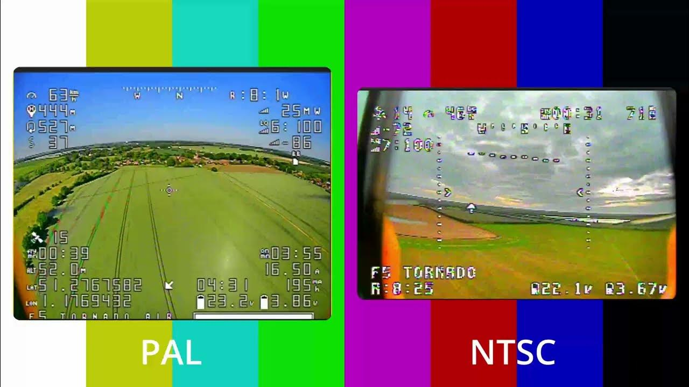
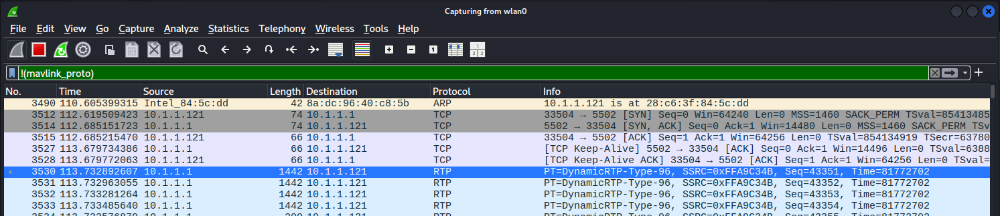
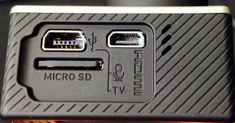

# UAV Cameras: Digital and Analog

**Type:** Presentation
**Duration:** 30 minutes
**Section:** Day 2 – Payloads & Logging

---

## Objectives

- Identify payload types carried by UAVs and how they integrate
- Understand analog video transmission standards (NTSC, PAL, SECAM)
- Understand digital video protocols used in drone streaming (RTP, RTSP)
- Map camera and payload attack surfaces

---

## UAV Payload Overview

A **payload** is anything a drone carries beyond its basic avionics. Payloads are the reason most drones fly.

### Passive / Sensor Payloads

| Payload | Use Case |
|---------|---------|
| Visible light camera | Photography, surveillance, inspection |
| Thermal / IR camera | Search and rescue, building inspection |
| Multispectral | Agricultural analysis |
| LiDAR | Surveying, mapping |
| Hyperspectral | Environmental monitoring |

### Active / Mechanical Payloads

| Payload | Use Case |
|---------|---------|
| Agricultural sprayer | Crop treatment |
| Cargo winch | Delivery operations |
| Payload release | Package drop |
| Parachute | Emergency recovery |
| Gripper | Object manipulation |
| Communication relay | Cellular on drone (COD) |

---

## Payload Integration Methods

Payloads communicate with the drone through several interfaces:

| Interface | Protocol | Example |
|-----------|----------|---------|
| WiFi | HTTP, RTSP | GoPro Hero, DJI Zenmuse |
| MAVLink | COMMAND_LONG, SERVO | Sprayer, winch, parachute |
| UART | Serial | Companion computer sensors |
| I2C / SPI | Bus protocols | IMU extensions |
| Ethernet | UDP, RTP | High-bandwidth video |
| RC (PWM) | Pulse width | Simple servo control |
| DroneCAN | CAN bus | Professional autopilot add-ons |

**Security implication:** Each interface is an additional attack surface. A compromised payload can pivot to the drone's data bus.

---

## Analog vs. Digital Video (The 30-Second Version)

There are two completely different ways a drone sends live video, and they fail differently:

| | **Analog** (this module + Lab 20) | **Digital** (RTP/RTSP over WiFi) |
|---|---|---|
| How | Paints the picture directly onto a 5.8 GHz radio wave | Compresses video into data packets (H.264) |
| To watch it | Tune a receiver to the right channel — that's it | Join the WiFi and open the stream URL |
| Security | **Zero** — no pairing, no encryption; anyone in range sees it | Usually also unencrypted, but at least needs network access |
| Feel | Fuzzy analog, instant, "old TV" | Sharp, slight delay, "video call" |

The big takeaway: **analog FPV has no concept of a password at all.** It's broadcast television. That's why Lab 20 needs only an SDR and an antenna — no cracking, no login.

---

## Analog Video Transmission: History and Standards

Before digital FPV systems, **analog video** was the standard for drone real-time video.



*The two dominant analog standards. You mostly care about which one a target uses so you can decode it (Lab 20) — NTSC in the Americas/Japan, PAL almost everywhere else.*

### NTSC (National Television System Committee)
- **Region:** USA, Canada, Japan, West South America
- **Introduced:** 1950s
- **Format:** Analog interlaced
- **Resolution:** 720 × 480 (4:3 aspect ratio)
- **Frame rate:** 29.97 fps
- **Color encoding:** YIQ (Luma + In-phase + Quadrature)
- **Subcarrier:** 3.58 MHz
- **Bandwidth:** 6 MHz per channel

### PAL (Phase Alternating Line)
- **Region:** Europe, UK, Australia, East South America, Africa
- **Introduced:** 1967
- **Format:** Analog interlaced
- **Resolution:** 720 × 576 (3:2 or 4:3)
- **Frame rate:** 25 fps
- **Color encoding:** YUV
- **Subcarrier:** 4.43 MHz
- **Bandwidth:** 8 MHz per channel

### SECAM (Séquentiel Couleur à Mémoire)
- **Region:** France, Eastern Europe, some of Africa
- **Introduced:** 1967
- **Format:** Analog interlaced
- **Resolution:** 720 × 576
- **Frame rate:** 25 fps
- **Color encoding:** FM (4.25 and 4.41 MHz subcarriers, sequential)

---

## FPV Analog Video Systems

**FPV (First-Person View)** drone racing and freestyle use analog video transmitters:

**Typical system:**
```
[FPV Camera] → [Video Transmitter (VTx)] → 5.8 GHz RF → [Video Receiver (VRx)] → [Monitor/Goggles]
```

**Common frequencies:** 5.645–5.945 GHz (40 channels)
**Transmit power:** 25 mW, 200 mW, or 600 mW (varies by regulation)
**Video format:** NTSC or PAL

**Security:** Analog FPV video is completely unencrypted and unencoded:
- Any video receiver tuned to the right frequency receives the feed
- No pairing — passive eavesdropping requires only a compatible receiver or SDR
- Video quality reveals sensitive imagery if operator has privacy expectations

---

## Digital Video: RTP/RTSP Streaming

Modern drones use **digital video streaming** over WiFi.

**The easy way to remember the two:** RTSP is the *remote control* (play/pause), RTP is the *video itself*. RTSP sets up the session; RTP carries the actual frames.

**RTP (Real-time Transport Protocol):**
- UDP-based protocol for real-time audio/video delivery — chosen because UDP is fast and a dropped frame doesn't stall the stream
- Each packet includes: payload type, sequence number, timestamp, SSRC (stream source ID)
- No connection setup — just start sending to the receiver

**RTSP (Real-Time Streaming Protocol):**
- Control protocol for RTP streams (like HTTP for streaming) — this is what your "play" button talks to
- `DESCRIBE` → `SETUP` → `PLAY` → `TEARDOWN`
- URL format: `rtsp://<ip>:<port>/<path>`



*RTP video packets in Wireshark. Because the stream is usually unencrypted, Wireshark can even reassemble the frames — Telephony → RTP → Stream Analysis will play the captured video back.*

**Common ports:**
- RTSP: TCP 554
- RTP: UDP 5004 / 5600 (varies)

**Example: 3DR Solo video stream**
```
rtsp://10.1.1.10:8554/solo.sdp
```

```bash
# Receive stream with VLC
vlc rtsp://10.1.1.10:8554/solo.sdp

# Capture with ffmpeg
ffmpeg -i rtsp://10.1.1.10:8554/solo.sdp -c copy captured-video.mp4
```

---

## GoPro Hero 4: HTTP API

The **GoPro Hero 3/4** used by the 3DR Solo has a WiFi interface with an HTTP API:



**IP address:** `10.5.5.9`
**Port:** `80` (HTTP)
**Authentication:** None (GoPro 4 and earlier)

**Key endpoints:**

| Endpoint | Action |
|----------|--------|
| `GET /gp/gpControl/status` | Get camera status |
| `GET /gp/gpControl/info` | Get camera model/firmware |
| `GET /gp/gpControl/command/shutter?p=1` | Start recording |
| `GET /gp/gpControl/command/shutter?p=0` | Stop recording |
| `GET /gp/gpControl/command/mode?p=0&s=0` | Switch to video mode |
| `GET /videos/DCIM/` | Browse recorded files |

```bash
# Access GoPro (from laptop connected to Solo WiFi)
curl http://10.5.5.9/gp/gpControl/info
curl http://10.5.5.9/gp/gpControl/status

# Start recording
curl http://10.5.5.9/gp/gpControl/command/shutter?p=1

# List recordings
curl http://10.5.5.9/videos/DCIM/
```

---

## Payload Security Summary

| Payload | Protocol | Encrypted | Authenticated |
|---------|----------|-----------|--------------|
| Analog FPV video | 5.8 GHz AM/FM | No | No |
| GoPro Hero 4 WiFi | HTTP/UDP | No | No |
| RTP/RTSP video | UDP/TCP | No (usually) | No (usually) |
| MAVLink payload control | UDP | No | No |
| DJI integrated camera | Proprietary | Yes | Yes |

**Key takeaway:** Most UAV camera and payload systems transmit data without encryption or authentication. An attacker in range can passively capture video and control payloads.
