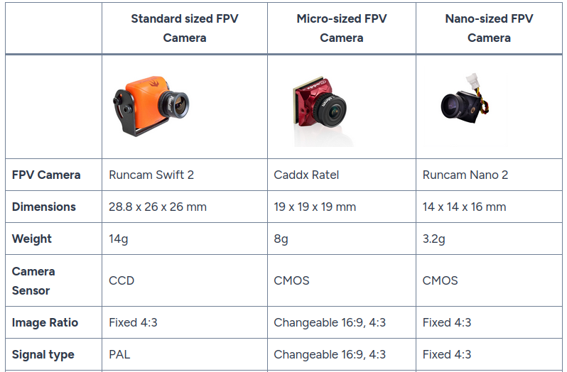
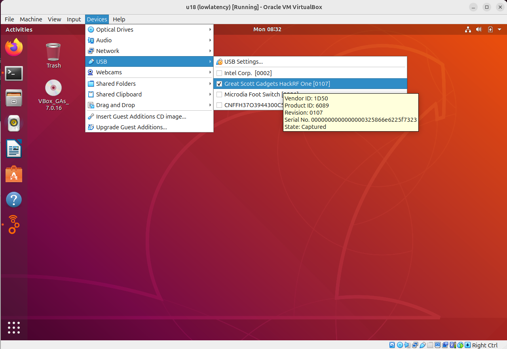
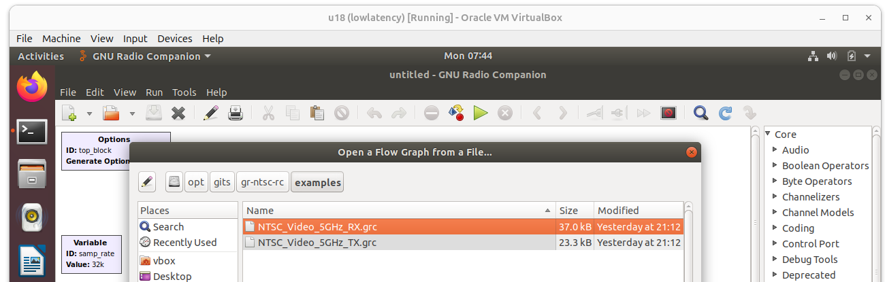
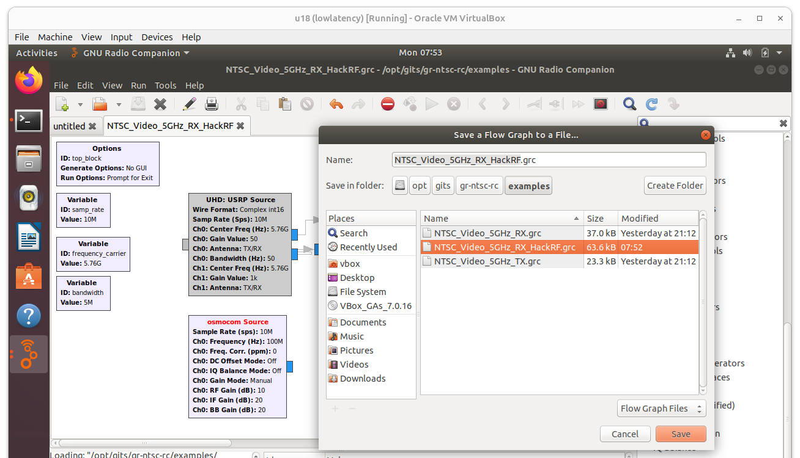
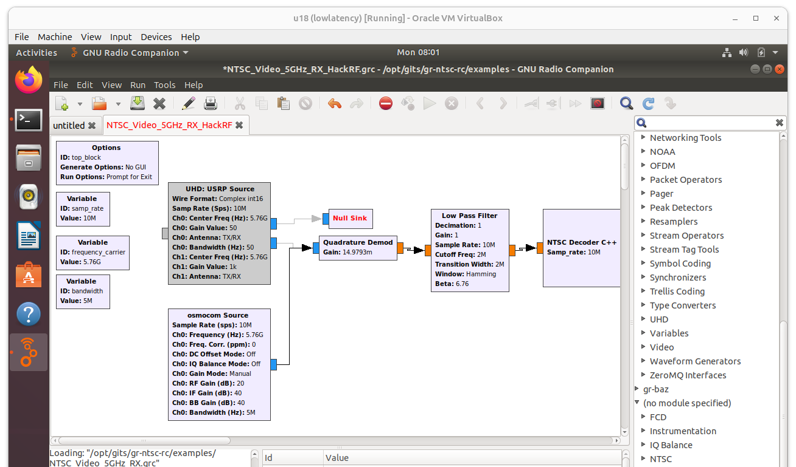
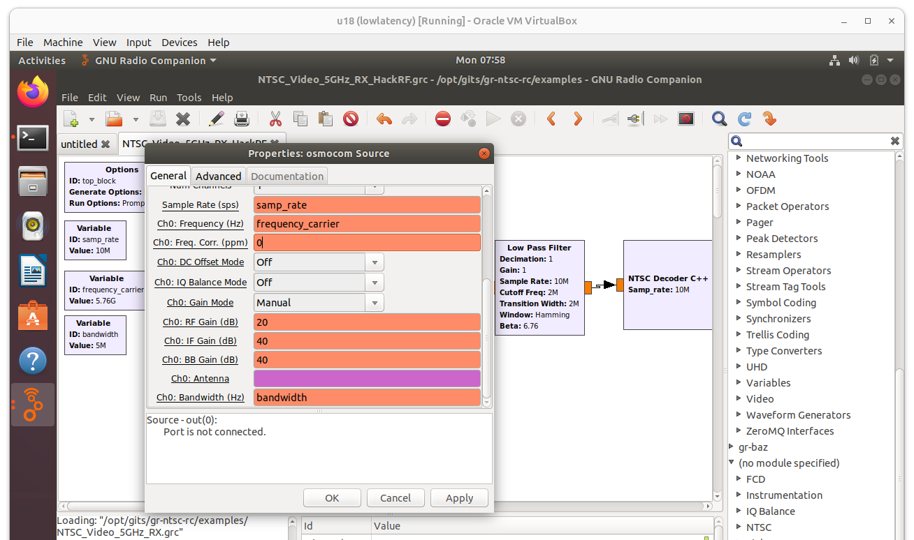
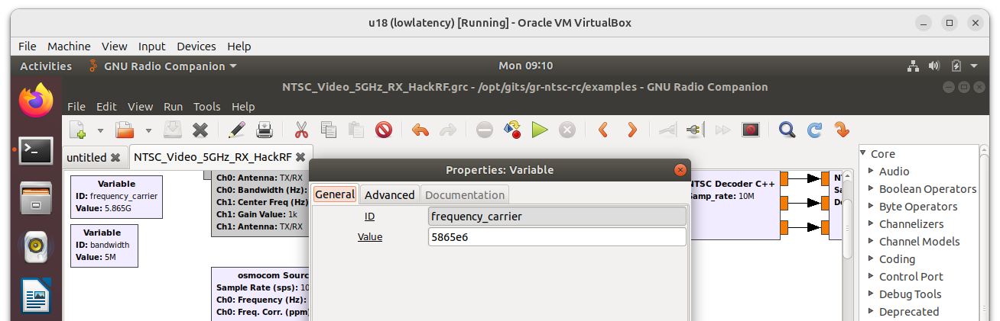
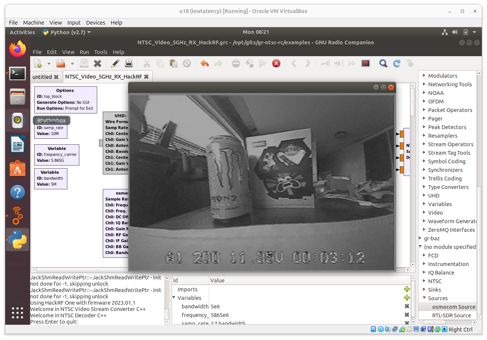

# Lab: Analog Video Transmission Sniffing

**Type:** Lab
**Duration:** 30 minutes
**Section:** Day 2 – Payloads & Logging

---

## Objectives

- Intercept unencrypted FPV video feeds using SDRangel and a HackRF One SDR
- Decode and view the intercepted video in real time


---
## The Big Picture (Read This First)

This is the **easiest attack of the whole course**, and that's exactly the point. Analog FPV video (Module 19) is broadcast television — no password, no pairing, no encryption. If you tune to the right channel, the picture simply appears.

You'll receive the drone's live video on a **HackRF** and rebuild the picture in software. There's nothing to "crack" — the only skill is tuning the radio and wiring up a decoder. When the camera feed pops onto your screen, you've demonstrated a total loss of **confidentiality** with a $300 SDR and an antenna.



*Typical FPV cameras + analog video transmitters. Whatever this camera sees is broadcast in the clear on 5.8 GHz — no pairing, no key.*

**How the decode works, conceptually:** the HackRF hands raw I/Q samples (Module 11) to a **GNU Radio** flow graph. The graph FM-demodulates the 5.8 GHz signal back into an analog video waveform, then an NTSC sink block paints that waveform into frames — the same way an old analog TV did.

---

## Analog Video Sniffing

### Background

Analog FPV video transmitters broadcast on 5.8 GHz. A HackRF One can receive these signals (1 MHz – 6 GHz). The video can then be decoded using software.

**Required:**
- HackRF One
- 5.8 GHz antenna (included in kit)
- Analog video transmitter (instructor setup)
- Software: **GNU Radio Companion** (with `gr-osmosdr` + the `gr-ntsc-rx` example flow graph)

**Install prerequisites (Ubuntu 18 VM):**
```bash
apt -y install build-essential git cmake
apt -y install libsdl1.2-dev gr-hackrf gr-osmosdr
```

--- 

## NTSC Analog Video Sniffing

### Step 1 — Start GNU Radio and attach the HackRF

- In VirtualBox, start the **Ubuntu 18** VM and log in as `vbox:vbox`
- Open a terminal and launch the flow-graph editor:

```bash
gnuradio-companion
```

- Connect the HackRF to the laptop, then pass it into the VM:
  **Devices → USB → Great Scott Gadgets HackRF One**



### Step 2 — Open the NTSC receive flow graph

**File → Open →** `/opt/gits/gr-ntsc-rx/examples` **→** `NTSC_Video_5GHz_RX.grx`



> **What is a "flow graph"?** GNU Radio builds a receiver by wiring **blocks** together like a flowchart: a *source* (the radio) feeds a *demodulator*, which feeds a *display sink*. You're not coding — you're connecting boxes that each do one signal-processing step.

### Step 3 — Swap in the HackRF (osmocom) source

The example targets a USRP radio; we retarget it to the HackRF:

- Right-click **UHD: USRP Source** → **Disable**
- Right-click **Null Sink** → **Disable**
- Use the search (magnifying glass) to find **Sources → osmocom Source** and drag it onto the canvas
- **File → Save As →** `NTSC_Video_5GHz_RX_HackRF.grc`



- Connect the **osmocom Source** output to the **Quadrature Demod** input (click the blue port on one, then the other — a line joins them)



### Step 4 — Set the radio parameters

Double-click **osmocom Source** and set:

| Field | Value |
|-------|-------|
| Ch0: Frequency (Hz) | `frequency_carrier` |
| Ch0: RF Gain (dB) | `20` |
| Ch0: IF Gain (dB) | `40` |
| Ch0: BB Gain (dB) | `40` |
| Ch0: Bandwidth (Hz) | `bandwidth` |



Then double-click the **Frequency Carrier** variable block and set the video channel:

```
frequency_carrier = 5865e6      # 5865 MHz — match the transmitter's channel
```



> **Gain tip:** RF/IF/BB gains are the three "volume knobs" of the receiver. Too low and the picture is pure snow; too high and it smears. If the video is noisy, nudge them up or down a little.

### Step 5 — Run it and watch the feed

- Press the **green ▶ arrow** to run the flow graph
- The intercepted **camera display** pops up in a new window — you are now watching the drone's live video
- Press the **red ✕** to stop



---

## Discussion Questions

1. You captured the video with no password and no interaction with the drone. Which CIA property (Module 1) did this break, and which were left intact?
2. Analog video has *no* encryption option at all. If an operator needs a private video link, what must they switch to?
3. How would an operator even *know* their analog feed was being watched? (Hint: passive receive emits nothing.)
4. At what range could this interception occur, and what changes that range?
